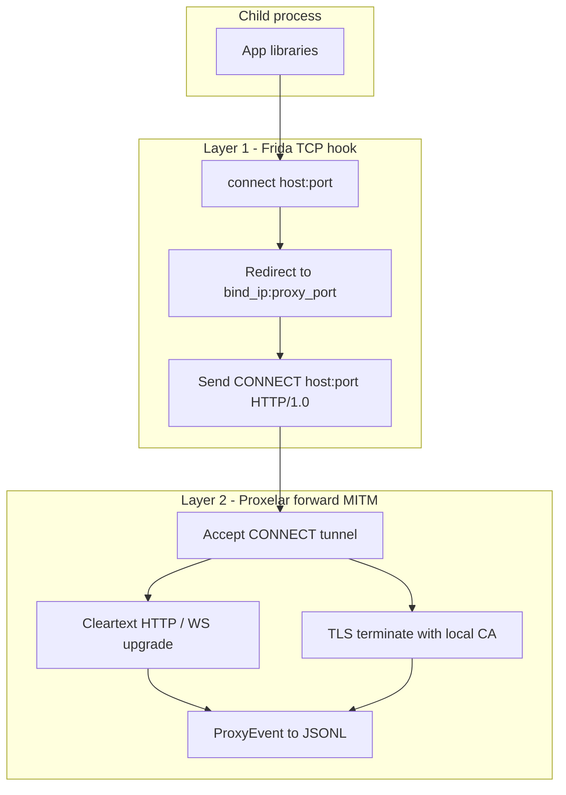
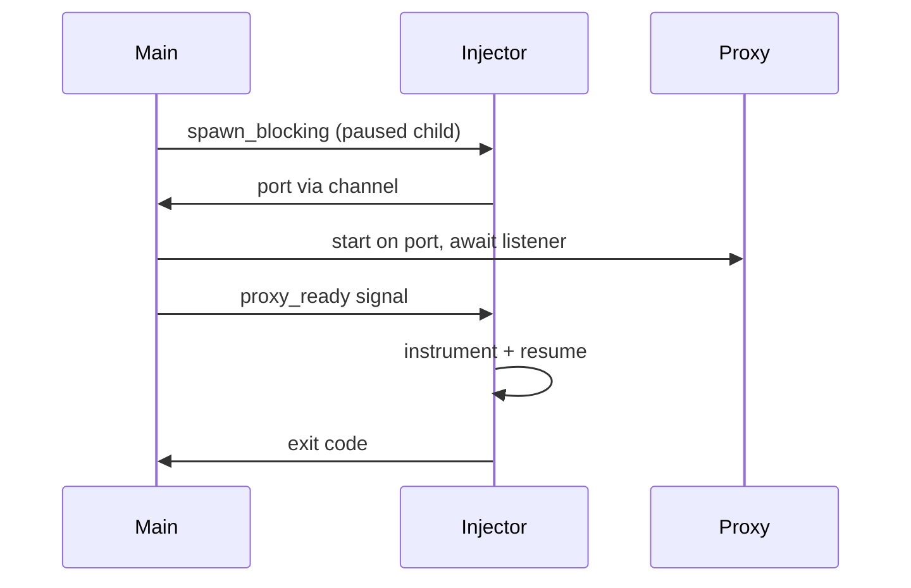

# Guardian — agent and contributor guide

Cross-platform Rust CLI that spawns a subcommand under Frida `connect()` hooking (fritm-style), MITM-intercepts HTTP, HTTPS, WS, and WSS via embedded [Proxelar](https://github.com/emanuele-em/proxelar) (`proxyapi`), and streams captured traffic as JSONL on stderr. Child stdout stays pipeable; `--silent` suppresses JSONL.

## Goal

`guardian -- curl https://httpbin.org/get` should intercept and log traffic for all four web schemes without manual CA setup.

| Scheme | How it is intercepted |
|--------|------------------------|
| HTTP | `connect()` → local proxy → `CONNECT` tunnel → cleartext HTTP |
| HTTPS | same redirect → Proxelar TLS MITM → decrypted HTTP |
| WS | cleartext HTTP upgrade → WebSocket events |
| WSS | TLS MITM first, then WebSocket events |

## Protocol interception

Two-layer design; scheme names are not parsed by Frida — interception is driven by TCP destinations, then protocol decoding in Proxelar.



**Layer 1** — hook `connect()` / `WSAConnect`; redirect to `bind_ip:proxy_port`; send synthetic `CONNECT` (fritm pattern). Platform-default filter when unset: ports `80` and `443` only (see `cli::default_filter()`).

**Layer 2** — `ProxyMode::Forward`, `intercept: None`, TLS MITM via Proxelar CA in `ca_dir`.

## Startup lifecycle



```text
main (tokio)
 ├─ resolve Settings (config + CLI)
 ├─ init tracing (prefixed; off unless -v / RUST_LOG)
 ├─ CaTrust::ensure_artifacts + Ssl::load_or_generate
 ├─ spawn_blocking:
 │    ├─ frida.spawn(env=ca_vars) → root_pid (suspended)
 │    ├─ resolve_listen_port → port
 │    ├─ await proxy ready (main starts proxy, signals injector)
 │    ├─ instrument(root): child_gating, connect_hook + env_inject, resume
 │    ├─ child-added / process-replaced → re-instrument
 │    └─ wait for root exit (Unix waitpid / Windows OpenProcess)
 ├─ JSONL sink task (event_rx → stderr)
 └─ exit(normalize_exit_code); Ctrl+C → detach sessions, exit 130
```

## Repository layout

```
guardian/
  Cargo.toml
  build.rs                 # rpath for libfrida-core
  rust-toolchain.toml
  config/guardian.toml       # shipped defaults (single source of truth)
  assets/connect_hook.js     # fritm-style connect redirect
  assets/env_inject.js       # exec/spawn CA env append
  scripts/build-local.sh
  scripts/build-release.sh   # cargo-zigbuild + cargo-xwin
  src/
    main.rs
    config.rs
    cli.rs
    port.rs
    proxy.rs
    injector.rs
    frida_ext.rs             # frida_sys child gating + session detached
    jsonl.rs
    ca.rs
```

## Module reference

### `config.rs` / `cli.rs`

Layered config (lowest → highest): shipped `config/guardian.toml` → `~/.config/guardian/guardian.toml` → `./guardian.toml` → `GUARDIAN_*` env → CLI flags.

CLI fields that map to file settings use `Option<T>` (no clap defaults) so file values apply when flags are omitted.

### `port.rs`

- **Auto**: `port_check::with_free_ipv4_port` within `[port_min, port_max]`
- **Override**: `--port` / config `port` binds exactly; fails on `EADDRINUSE`

### `proxy.rs`

Embedded Proxelar forward proxy. Listener readiness: poll `TcpStream::connect` until success or `proxy_ready_timeout_secs`.

### `injector.rs`

Frida spawn (paused) → port → proxy ready → instrument → wait. Typed `ProcessEvent` channel (`ChildAdded`, `ChildRemoved`, `ProcessReplaced`). Child instrument failures propagate (abort run).

### `frida_ext.rs`

Wrappers for `frida_session_enable_child_gating_sync` and GObject signals `child-added` / `child-removed` on device, `detached` on session (for `process-replaced` re-attach).

### `ca.rs`

Builds `guardian-ca-bundle.pem` (system roots + `proxelar-ca.pem`), optional Java PKCS12 truststore, injects PEM env vars into child + `env_inject.js` for exec descendants.

### `jsonl.rs`

`ProxyEvent` → one JSON line on stderr. Skips `RequestIntercepted`. Body previews truncated to `body_limit`.

## JSONL event types

| ProxyEvent | JSONL `type` |
|------------|--------------|
| RequestComplete | `http` |
| WebSocketConnected | `websocket_connect` |
| WebSocketFrame | `websocket_frame` |
| WebSocketClosed | `websocket_close` |
| Error | `error` |
| RequestIntercepted | (skipped) |

## Build

**Prerequisites (Linux):** Rust stable (`rust-toolchain.toml`), `libclang-dev` (for `frida-sys` / bindgen).

```bash
sudo apt install libclang-dev
cargo build --release
# or: scripts/build-local.sh
```

Binary: `target/release/guardian`. Ship `libfrida-core` beside the binary when dynamically linked (`build.rs` sets `rpath $ORIGIN` on Linux, `@loader_path` on macOS).

### Cross-compilation

[`scripts/build-release.sh`](scripts/build-release.sh) uses `cargo-zigbuild` (Linux/macOS) and `cargo-xwin` (Windows MSVC). macOS cross from Linux needs an SDK (e.g. `ghcr.io/rust-cross/cargo-zigbuild` Docker image).

| OS | Library | Load path |
|----|---------|-----------|
| Linux | `libfrida-core.so` | `$ORIGIN` |
| macOS | `libfrida-core.dylib` | `@loader_path` |
| Windows | `frida-core.dll` | same directory as exe |

## Testing

Real integration only: `tests/` spawns the real `guardian` binary with Frida injection, Proxelar MITM, and live `curl` to httpbin (default `http://httpbin.org/get`; override with `SMOKE_URL`). No constructed `ProxyEvent` fixtures or proxy-only shortcuts.

```bash
cargo test --features ws-smoke
cargo build --release
```

Integration tests use `getent ahostsv4` + `curl --resolve` because DNS from hooked processes is unreliable in WSL.

| Layer | What runs |
|-------|-----------|
| `tests/https_*.rs`, `silent.rs`, `verbose.rs`, `fixed_port.rs`, `body_limit.rs`, `config_file.rs`, `binary_post.rs` | HTTP MITM + JSONL assertions |
| `tests/env_*.rs`, `java_truststore.rs` | Real CA/env injection (portable JDK under `.cache/jdk-17` for PKCS12 path) |
| `tests/websocket.rs` + `guardian-ws-smoke` bin | Live `wss://echo.websocket.org/` WebSocket JSONL |
| `tests/invalid_bind.rs`, `spawn_failure.rs` | CLI / spawn error paths |
| `src/port.rs`, `src/config.rs`, `src/cli.rs`, `src/injector.rs`, `src/main.rs` | Small unit tests for real parsing, hooks, and OS primitives |

### Smoke (release artifacts)

Prerequisites: `cargo-zigbuild`, `curl`, Frida devkits via `frida` crate `auto-download`. Windows host: Strawberry Perl + LLVM for native MSVC build (`build-win-smoke.ps1`).

```bash
./scripts/build-smoke.sh          # zigbuild linux-gnu + stage runtime libs
./scripts/build-win-smoke.ps1     # native Windows MSVC (from WSL via powershell.exe)
./scripts/smoke/run.sh            # Linux ELF smoke (WSL)
./scripts/smoke-all.sh            # build-smoke + build-win-smoke + Linux + Windows smoke
```

Override binary during dev: `GUARDIAN_BIN=target/debug/guardian ./scripts/smoke/run.sh`.

Windows smoke runs `%USERPROFILE%\guardian-smoke-build\target\release\guardian.exe` (repo synced to NTFS via `sync-win-smoke-build.ps1` before `cargo build --release`).

`SMOKE_URL` overrides the default live endpoint. `SMOKE_SKIP_BUILD=1` skips `build-smoke.sh` in `smoke-all.sh`.

### Coverage (~90% per OS)

Prerequisites: `cargo install cargo-llvm-cov`, `rustup component add llvm-tools-preview` (WSL and Windows host). `coverage.sh` downloads a portable Temurin JDK 17 into `.cache/jdk-17` so the Java truststore path is exercised.

Windows host additionally needs [Strawberry Perl](https://strawberryperl.com/) and [LLVM](https://releases.llvm.org/) (`LIBCLANG_PATH`) for native `cargo build` / `cargo llvm-cov` (Frida bindgen).

```bash
./scripts/coverage.sh                                    # Linux/WSL: integration tests + --features ws-smoke
powershell.exe -NoProfile -File scripts/coverage.ps1     # native Windows MSVC (same feature flag)
```

Coverage uses `cargo llvm-cov` on the real `tests/` crate (not cross-compiled smoke release binaries). Scripts enforce `--fail-under-lines 90` per OS. Add new **real** integration scenarios rather than mocks or widening `.llvmcov.toml` beyond `build.rs` if coverage drops.

### Manual smoke

```bash
guardian -- /usr/bin/curl -sSf --resolve httpbin.org:80:IP http://httpbin.org/get
guardian -- /usr/bin/sh -c '/usr/bin/curl -sSf --resolve httpbin.org:80:IP http://httpbin.org/get'
```

Use full executable paths for Frida spawn. Default connect filter hooks ports `80` and `443` only (`cli::default_filter()`).

## Known limitations

- IPv6 `connect()` not hooked; IPv6 `--bind` rejected
- Certificate pinning / custom trust stores block MITM
- Frida permissions required (see README permissions tables)
- Go HTTPS on Windows uses system store, not PEM env vars
- Non-HTTP TCP tunneled but not logged in JSONL
- QUIC/UDP not intercepted
- WSL2: Linux ELF only

## Configuration reference

Defaults live in [`config/guardian.toml`](config/guardian.toml) and [`FileSettings::default()`](src/config.rs). Override via user config, `GUARDIAN_*` env, or CLI.

### User-facing (CLI + config file)

| Key | CLI flag | Env | Default | Description |
|-----|----------|-----|---------|-------------|
| `bind` | `-b, --bind` | `GUARDIAN_BIND` | `127.0.0.1` | Proxy bind IPv4 (`BIND_HOST` in hook) |
| `port` | `-p, --port` | `GUARDIAN_PORT` | (unset) | Fixed listen port; omit for auto |
| `body_limit` | `--body-limit` | `GUARDIAN_BODY_LIMIT` | `256` | JSONL body/frame preview max bytes |
| `filter` | `--filter` | `GUARDIAN_FILTER` | platform default | JS connect filter expression |
| `ca_dir` | `--ca-dir` | `GUARDIAN_CA_DIR` | `~/.proxelar` | Proxelar CA directory |
| `silent` | `--silent` | `GUARDIAN_SILENT` | `false` | Suppress JSONL on stderr |
| — | `--config` | — | — | Extra config file path |
| — | `-v` | `RUST_LOG` | off | Internal tracing to stderr |

Platform default `filter` when unset: `(sa_family == 2 || sa_family == 0) && (port == 80 || port == 443)` (Unix), `port == 80 || port == 443` (Windows). Not a config key — resolved in `cli::default_filter()`.

### Internal tuning (config file + env only)

| Key | Env | Default | Description |
|-----|-----|---------|-------------|
| `port_min` | `GUARDIAN_PORT_MIN` | `1024` | Auto port range floor |
| `port_max` | `GUARDIAN_PORT_MAX` | `65535` | Auto port range ceiling |
| `proxy_event_channel_capacity` | `GUARDIAN_PROXY_EVENT_CHANNEL_CAPACITY` | `10000` | ProxyEvent channel size |
| `proxy_ready_timeout_secs` | `GUARDIAN_PROXY_READY_TIMEOUT_SECS` | `5` | Max wait for proxy listener |
| `proxy_ready_poll_ms` | `GUARDIAN_PROXY_READY_POLL_MS` | `10` | Listener poll interval |
| `process_poll_interval_ms` | `GUARDIAN_PROCESS_POLL_INTERVAL_MS` | `50` | Root process wait poll |
| `ca_bundle_name` | `GUARDIAN_CA_BUNDLE_NAME` | `guardian-ca-bundle.pem` | Combined PEM bundle filename |
| `java_truststore_name` | `GUARDIAN_JAVA_TRUSTSTORE_NAME` | `guardian-java-truststore.p12` | Java truststore filename |
| `java_truststore_password` | `GUARDIAN_JAVA_TRUSTSTORE_PASSWORD` | `guardian` | PKCS12 password |
| `deno_tls_ca_store` | `GUARDIAN_DENO_TLS_CA_STORE` | `system,mozilla` | Injected `DENO_TLS_CA_STORE` |
| `node_options_append` | `GUARDIAN_NODE_OPTIONS_APPEND` | `--use-openssl-ca` | Appended to `NODE_OPTIONS` |
| `tracing_prefix` | `GUARDIAN_TRACING_PREFIX` | `guardian: ` | Prefix for tracing lines |
| `tracing_default_level` | `GUARDIAN_TRACING_DEFAULT_LEVEL` | `guardian=debug` | Filter when `-v` without valid `RUST_LOG` |

### Not configurable (by design)

- `proxelar-ca.pem` / `.key` — Proxelar `Ssl::load_or_generate` contract
- `PEM_ENV_VARS` list in `ca.rs` — cross-ecosystem injection contract
- Frida script templates (`assets/*.js`)
- Ctrl+C exit code `130`
- OS constants (`STILL_ACTIVE`, etc.)

## Future hooks

- `guardian attach <pid>`
- proxychains-style config
- HAR export (`--har`)
- GitHub Actions CI
- IPv6 connect hook + bind
