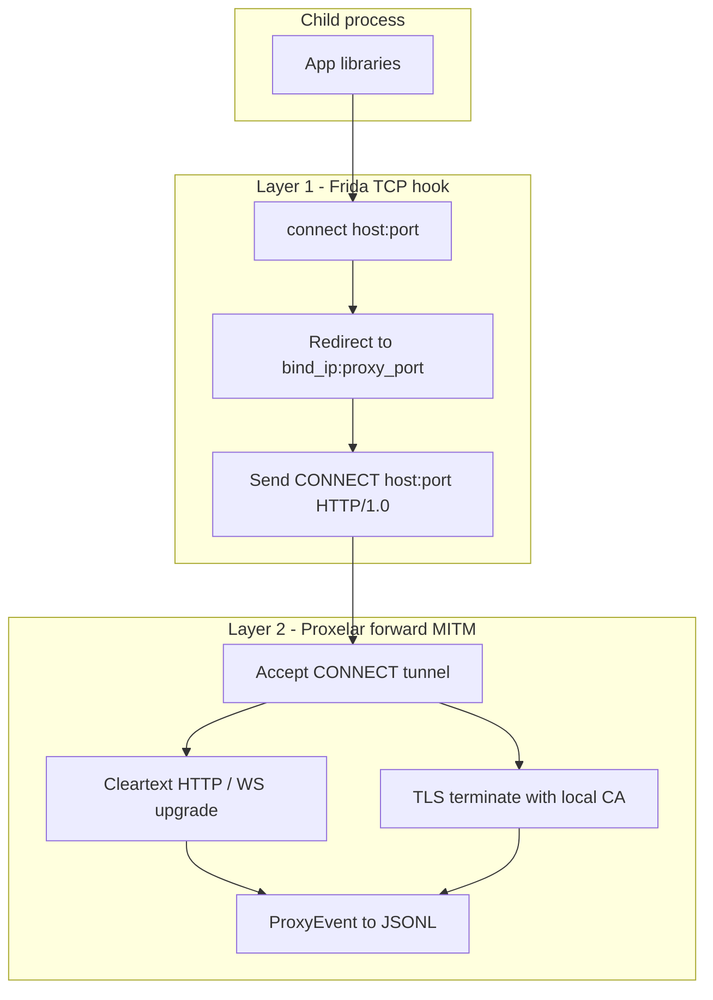
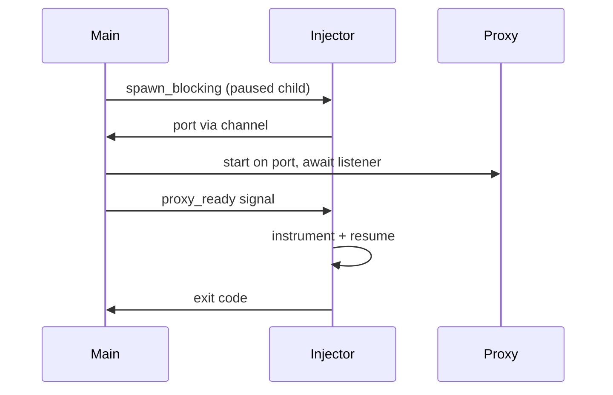

# Guardian — agent and contributor guide

Cross-platform Rust CLI that spawns a subcommand under Frida `connect()` hooking (fritm-style), MITM-intercepts HTTP, HTTPS, WS, and WSS via embedded [Proxelar](https://github.com/emanuele-em/proxelar) (`proxyapi`), and streams captured traffic as JSONL on stderr. Child stdout stays pipeable; `--silent` suppresses JSONL.

## Goal

`guardian -- curl https://httpbin.org/get` should intercept and log traffic for all four web schemes without manual CA setup.

| Scheme | How it is intercepted |
|--------|------------------------|
| HTTP | `connect()` → local proxy → `CONNECT` tunnel → cleartext HTTP |
| HTTPS | same redirect → Proxelar TLS MITM → decrypted HTTP |
| WS | cleartext HTTP upgrade → WebSocket events |
| WSS | TLS MITM first, then WebSocket events |

## Protocol interception

Two-layer design; scheme names are not parsed by Frida — interception is driven by TCP destinations, then protocol decoding in Proxelar.



**Layer 1** — hook `connect()` / `WSAConnect` for **TCP only** (UDP passes through unchanged, including DNS); redirect to `bind_ip:proxy_port`; send synthetic `CONNECT` (fritm pattern). Default filter when unset: all IPv4 TCP except `ignored_ports` (HTTP Toolkit-style denylist; see `config/guardian.toml` and `filter::connect_filter_from_ports()`).

**Layer 2** — `ProxyMode::Forward`, `intercept: None`, TLS MITM via Proxelar CA in `ca_dir`.

## Startup lifecycle



```text
main (tokio)
 ├─ resolve Settings (config + CLI)
 ├─ init tracing (prefixed; off unless -v / RUST_LOG)
 ├─ CaTrust::ensure_artifacts + Ssl::load_or_generate
 ├─ spawn_blocking:
 │    ├─ frida.spawn(envp=parent+ca) → root_pid (suspended)
 │    ├─ resolve_listen_port → port
 │    ├─ await proxy ready (main starts proxy, signals injector)
 │    ├─ instrument(root): child_gating, connect_hook + env_inject, resume
 │    ├─ child-added / process-replaced → re-instrument
 │    └─ wait for root exit (Unix waitpid / Windows OpenProcess)
 ├─ JSONL sink task (event_rx → stderr)
 └─ exit(normalize_exit_code); Ctrl+C → detach sessions, exit 130
```

## Repository layout

```
guardian/
  Cargo.toml
  build.rs                 # rpath for libfrida-core
  rust-toolchain.toml
  config/guardian.toml       # shipped defaults (single source of truth)
  assets/connect_hook.js     # fritm-style connect redirect
  assets/env_inject.js       # exec/spawn CA env append
  package.json               # zx/tsx smoke + coverage scripts
  scripts/
    smoke.zx.ts              # host dispatch → build + smoke cases
    coverage.zx.ts           # host dispatch → coverage-{linux,mac,win}
    build-*-smoke.zx.ts
    coverage-*.zx.ts
    smoke/                   # TypeScript smoke suite
  src/
    main.rs
    config.rs
    cli.rs
    port.rs
    proxy.rs
    injector.rs
    frida_ext.rs             # frida_sys child gating + session detached
    jsonl.rs
    ca.rs
```

## Module reference

### `config.rs` / `cli.rs`

Layered config (lowest → highest): shipped `config/guardian.toml` → `~/.guardian/guardian.toml` → `./guardian.toml` → `GUARDIAN_*` env → CLI flags.

CLI fields that map to file settings use `Option<T>` (no clap defaults) so file values apply when flags are omitted.

### `port.rs`

- **Auto**: `port_check::with_free_ipv4_port` within `[port_min, port_max]`
- **Override**: `--port` / config `port` binds exactly; fails on `EADDRINUSE`

### `proxy.rs`

Embedded Proxelar forward proxy. Listener readiness: poll `TcpStream::connect` until success or `proxy_ready_timeout_secs`.

### `injector.rs`

Frida spawn (paused) → port → proxy ready → instrument → wait. Typed `ProcessEvent` channel (`ChildAdded`, `ChildRemoved`, `ProcessReplaced`). Child instrument failures propagate (abort run).

### `frida_ext.rs`

Wrappers for `frida_session_enable_child_gating_sync` and GObject signals `child-added` / `child-removed` on device, `detached` on session (for `process-replaced` re-attach).

### `ca.rs`

Builds `guardian-ca-bundle.pem` (system roots + `rootCA.pem`), optional Java PKCS12 truststore, injects PEM env vars into child + `env_inject.js` for exec descendants.

### `jsonl.rs`

`ProxyEvent` → one JSON line on stderr. Skips `RequestIntercepted`. Body previews truncated to `body_limit`.

## JSONL event types

| ProxyEvent | JSONL `type` |
|------------|--------------|
| RequestComplete | `http` |
| WebSocketConnected | `websocket_connect` |
| WebSocketFrame | `websocket_frame` |
| WebSocketClosed | `websocket_close` |
| Error | `error` |
| RequestIntercepted | (skipped) |

## Build

**Prerequisites:** Rust stable (`rust-toolchain.toml`), Node.js (`npm install` for zx/tsx scripts).

**Linux:** `libclang-dev` (for `frida-sys` / bindgen).

```bash
sudo apt install libclang-dev   # Linux only
npm install
cargo build --release
```

`proxyapi` is patched via `patches/proxyapi+0.4.5.patch` ([cargo-patch-crate](https://github.com/mokeyish/cargo-patch-crate) format). The patched tree lands in `target/patch/` (gitignored). Before the first `cargo` command on a fresh clone:

```bash
cargo run --quiet --manifest-path tools/patch-proxyapi/Cargo.toml
```

npm/zx scripts (`smoke`, `coverage`, release builds) run that automatically.

Binary: `target/release/guardian`. Ship `libfrida-core` beside the binary when dynamically linked (`build.rs` sets `rpath $ORIGIN` on Linux, `@loader_path` on macOS).

| OS | Library | Load path |
|----|---------|-----------|
| Linux | `libfrida-core.so` | `$ORIGIN` |
| macOS | `libfrida-core.dylib` | `@loader_path` |
| Windows | `frida-core.dll` | same directory as exe |

All platforms use **native** `cargo build --release` on the host — no cross-compilation.

## Testing

Real integration only: `tests/` spawns the real `guardian` binary with Frida injection, Proxelar MITM, and live `curl` to httpbin (default `http://httpbin.org/get`; override with `SMOKE_URL`). No constructed `ProxyEvent` fixtures or proxy-only shortcuts.

```bash
cargo test --features ws-smoke
cargo build --release
```

Integration tests use live DNS (`tests/dns_resolution.rs`: `getent` / `curl` under guardian with no manual `--resolve`).

| Layer | What runs |
|-------|-----------|
| `tests/https_*.rs`, `silent.rs`, `verbose.rs`, `fixed_port.rs`, `body_limit.rs`, `config_file.rs`, `binary_post.rs` | HTTP MITM + JSONL assertions |
| `tests/env_*.rs`, `java_truststore.rs` | Real CA/env injection (portable JDK under `.cache/jdk-17` for PKCS12 path) |
| `tests/websocket.rs` + `guardian-ws-smoke` bin | Live `wss://echo.websocket.org/` WebSocket JSONL |
| `tests/dns_resolution.rs`, `tests/non_http_passthrough.rs`, `tests/custom_http_port.rs` | Live DNS resolution + denylist connect filter |
| `tests/invalid_bind.rs`, `spawn_failure.rs` | CLI / spawn error paths |
| `src/port.rs`, `src/config.rs`, `src/cli.rs`, `src/injector.rs`, `src/main.rs` | Small unit tests for real parsing, hooks, and OS primitives |

### Smoke (release artifacts)

Prerequisites: `curl`, Frida devkits via `frida` crate `auto-download`, `npm install`. Windows host: Strawberry Perl + LLVM (`LIBCLANG_PATH`) for Frida bindgen. macOS host: Xcode Command Line Tools; taskport authorization for SSH/headless (see README). `build-mac-smoke.zx.ts` ad-hoc signs `guardian` and stages signed `guardian-curl` / `guardian-env` (Frida cannot attach to unsigned SIP-protected binaries). macOS child spawn uses `guardian-env curl …` instead of `sh -c`. `coverage-mac.zx.ts` signs instrumented binaries via `rustc-codesign-wrapper.zx.ts`, sets `LLVM_PROFILE_FILE=target/guardian-%p.profraw`, and runs with `--test-threads=1`. `guardian-ws-smoke` uses native-tls on macOS for WSS; Linux/Windows use rustls.

**Platform model:** each host runs its own zx scripts locally. `smoke.zx.ts` detects the host via `os.platform()` and runs the matching build + smoke cases. No cross-host orchestration in the repo.

| Role | Linux | macOS | Windows |
|------|-------|-------|---------|
| Build | `build-linux-smoke.zx.ts` | `build-mac-smoke.zx.ts` | `build-win-smoke.zx.ts` |
| Smoke entry | `smoke.zx.ts` | `smoke.zx.ts` | `smoke.zx.ts` |
| Coverage entry | `coverage.zx.ts` | `coverage.zx.ts` | `coverage.zx.ts` |

```bash
npm install
npm run smoke                    # build + smoke cases on current host

NODE_OPTIONS='--import tsx' zx scripts/build-linux-smoke.zx.ts
NODE_OPTIONS='--import tsx' zx scripts/build-mac-smoke.zx.ts
NODE_OPTIONS='--import tsx' zx scripts/build-win-smoke.zx.ts
```

Smoke cases live in [`scripts/smoke/cases.ts`](scripts/smoke/cases.ts). `SMOKE_URL` overrides the default live endpoint (`http://httpbin.org/get`).

### Coverage (~90% per OS)

Prerequisites: `cargo install cargo-llvm-cov`, `rustup component add llvm-tools-preview`, `npm install`. Coverage scripts download Temurin JDK 17 into `.cache/jdk-17` for the Java truststore integration test.

```bash
npm run coverage
```

Coverage uses `cargo llvm-cov` on the real `tests/` crate with `--fail-under-lines 90`. Add new **real** integration scenarios rather than mocks or widening `.llvmcov.toml` beyond `build.rs` if coverage drops.

### Manual smoke

```bash
guardian -- curl -sSf https://httpbin.org/get
guardian -- sh -c 'curl -sSf https://httpbin.org/get'
```

Bare command names are resolved via `PATH` before Frida spawn; absolute and relative paths still work. Default connect filter intercepts all IPv4 TCP except ports listed in `ignored_ports` (`config/guardian.toml`, `--ignored-ports`, or built-in defaults in `filter::DEFAULT_IGNORED_PORTS`).

## System CA trust (`install-system` / `remove-system` / `check-system`)

- **Install/remove** orchestrate an embedded [mkcert](https://github.com/FiloSottile/mkcert) binary (`include_bytes!` from `build.rs` download into `OUT_DIR`). Runtime extract: `~/.guardian/bin/mkcert[.exe]`. `CAROOT=<ca_dir>`; CA files `rootCA.pem` / `rootCA-key.pem` (patched `proxyapi` `Ssl::load_or_generate`).
- **Admin gate** — `privilege::user::privileged()` at start of install/remove only; never for `check-system` or run mode.
- **check-system** — read-only verification in `system_trust.rs` (system roots fingerprint, optional `certutil` NSS, optional `keytool` Java). Exit `0` if all requested stores pass.
- **Run-mode warnings** — `ui::warn` capture disclaimer always; trust hint when `is_installed` is false.
- **Store selection** — `--stores` / `GUARDIAN_TRUST_STORES` / config `trust_stores`; forwarded to mkcert as `TRUST_STORES` on install/remove.
- See [`NOTICES`](NOTICES) for mkcert BSD-3-Clause attribution.

## Colored stderr (`ui.rs` + `colored`)

Guardian-owned stderr only (not child or mkcert output):

| Stream | Color |
|--------|-------|
| JSONL (`jsonl::run_sink`) | Light blue |
| User warnings / advisories | Yellow |
| User errors (e.g. admin required) | Red |
| Tracing (`-v`) | Level-based ANSI via `tracing_subscriber` |

Disable: `--no-color`, `no_color = true` in config, or `GUARDIAN_NO_COLOR`. Sets `colored::control::set_override(false)`.

## Permissions

Guardian uses Frida **spawn** (not attach-to-existing). Requirements below are per OS.

### Linux

Frida injects via `ptrace`. On a normal host, spawning a same-user program works with the default Yama setting (`kernel.yama.ptrace_scope=1` on Ubuntu/Debian).

| Condition | What happens |
|-----------|--------------|
| Spawn same-user child (guardian’s normal path) | Works at `ptrace_scope` **1** (parent→descendant is allowed) |
| `ptrace_scope` **0** | Any same-uid, dumpable process can be attached |
| `ptrace_scope` **2** | Only root (`CAP_SYS_PTRACE`) can ptrace — run guardian as root, or temporarily `sudo sysctl kernel.yama.ptrace_scope=0` |
| `ptrace_scope` **3** | Ptrace disabled system-wide (cannot be changed back) |
| Target is another user’s process | Root required |
| Target exec’d a setuid/setgid binary (or dropped privs via `setuid`) | Process is non-dumpable; ptrace fails unless root or the target calls `prctl(PR_SET_DUMPABLE, 1)` |
| Inside Docker/Podman with default seccomp | `ptrace` is blocked — start the container with `--security-opt seccomp=unconfined` (see [Frida Linux/Docker docs](https://frida.re/docs/examples/linux/)) |

Check current value: `sysctl kernel.yama.ptrace_scope` or `cat /proc/sys/kernel/yama/ptrace_scope`.

### macOS

Frida needs `task_for_pid` to spawn/inject. **Root is not required** for normal user binaries.

| Condition | What happens |
|-----------|--------------|
| First run from Terminal.app | `taskgate` prompts to allow debugging — approve once per guardian binary |
| Headless / SSH (no prompt) | `sudo security authorizationdb write system.privilege.taskport allow` (weakens security; see [Frida troubleshooting](https://frida.re/docs/troubleshooting/)) |
| Target in SIP-protected paths (`/System`, `/usr` except `/usr/local`, platform binaries) | Blocked while SIP is enabled — not typical for `curl`/`sh` in `$PATH` |
| Target has **Hardened Runtime** + library validation (most App Store / notarized apps) | Frida’s agent cannot load unless the target has `com.apple.security.cs.disable-library-validation` |
| Release-signed target without `com.apple.security.get-task-allow` | Spawn/attach denied — re-sign the target with that entitlement, or use a debug build |

Prebuilt `libfrida-core` from Frida releases is already codesigned.

### Windows

Injection requires the **same or higher integrity level** as the target. Guardian does not need admin for normal (medium-IL) programs.

| Condition | What happens |
|-----------|--------------|
| Guardian and target both non-elevated (medium IL) | Works out of the box |
| Target is elevated (high IL, “Run as administrator”) | Run guardian elevated too |
| Target is **Protected Process Light** (PPL) or anti-malware protected | Injection blocked regardless of admin |
| Third-party AV/EDR | May block DLL injection into the child |

## Known limitations

- IPv6 `connect()` not hooked; IPv6 `--bind` rejected
- Certificate pinning / custom trust stores block MITM
- Frida permissions required (see Permissions above)
- Go HTTPS on Windows uses system store, not PEM env vars
- Non-HTTP TCP tunneled but not logged in JSONL
- QUIC/UDP not intercepted
- WSL2: Linux ELF only

## Configuration reference

Defaults live in [`config/guardian.toml`](config/guardian.toml) and [`FileSettings::default()`](src/config.rs). Override via user config, `GUARDIAN_*` env, or CLI.

### User-facing (CLI + config file)

| Key | CLI flag | Env | Default | Description |
|-----|----------|-----|---------|-------------|
| `bind` | `-b, --bind` | `GUARDIAN_BIND` | `127.0.0.1` | Proxy bind IPv4 (`BIND_HOST` in hook) |
| `port` | `-p, --port` | `GUARDIAN_PORT` | (unset) | Fixed listen port; omit for auto |
| `body_limit` | `--body-limit` | `GUARDIAN_BODY_LIMIT` | `256` | JSONL body/frame preview max bytes |
| `filter` | `--filter` | `GUARDIAN_FILTER` | (unset) | JS connect filter; when unset, built from `ignored_ports` |
| `ignored_ports` | `--ignored-ports` | — | see `config/guardian.toml` | TCP ports left unhooked when `filter` is unset |
| `ca_dir` | `--ca-dir` | `GUARDIAN_CA_DIR` | `~/.guardian` | Guardian data directory (CA + config) |
| `silent` | `--silent` | `GUARDIAN_SILENT` | `false` | Suppress JSONL on stderr |
| `no_color` | `--no-color` | `GUARDIAN_NO_COLOR` | `false` | Disable colored Guardian stderr |
| `trust_stores` | `--stores` (system subcommands) | `GUARDIAN_TRUST_STORES` | `system,nss,java` | Stores for install/check/remove |
| — | `--config` | — | — | Extra config file path |
| — | `-v` | `RUST_LOG` | off | Internal tracing to stderr |

Platform default `filter` when unset: IPv4 TCP except `ignored_ports` (SSH 22, DNS 53, Postgres 5432, etc.). Proxelar sniffs redirected traffic and only MITM-logs HTTP/TLS/WebSocket; unknown protocols are tunneled without JSONL. Override ports with `ignored_ports` / `--ignored-ports`, or replace the whole expression with `--filter` / `GUARDIAN_FILTER`.

### Internal tuning (config file + env only)

| Key | Env | Default | Description |
|-----|-----|---------|-------------|
| `port_min` | `GUARDIAN_PORT_MIN` | `1024` | Auto port range floor |
| `port_max` | `GUARDIAN_PORT_MAX` | `65535` | Auto port range ceiling |
| `proxy_event_channel_capacity` | `GUARDIAN_PROXY_EVENT_CHANNEL_CAPACITY` | `10000` | ProxyEvent channel size |
| `proxy_ready_timeout_secs` | `GUARDIAN_PROXY_READY_TIMEOUT_SECS` | `5` | Max wait for proxy listener |
| `proxy_ready_poll_ms` | `GUARDIAN_PROXY_READY_POLL_MS` | `10` | Listener poll interval |
| `process_poll_interval_ms` | `GUARDIAN_PROCESS_POLL_INTERVAL_MS` | `50` | Root process wait poll |
| `ca_bundle_name` | `GUARDIAN_CA_BUNDLE_NAME` | `guardian-ca-bundle.pem` | Combined PEM bundle filename |
| `java_truststore_name` | `GUARDIAN_JAVA_TRUSTSTORE_NAME` | `guardian-java-truststore.p12` | Java truststore filename |
| `java_truststore_password` | `GUARDIAN_JAVA_TRUSTSTORE_PASSWORD` | `guardian` | PKCS12 password |
| `deno_tls_ca_store` | `GUARDIAN_DENO_TLS_CA_STORE` | `system,mozilla` | Injected `DENO_TLS_CA_STORE` |
| `node_options_append` | `GUARDIAN_NODE_OPTIONS_APPEND` | `--use-openssl-ca` | Appended to `NODE_OPTIONS` |
| `tracing_prefix` | `GUARDIAN_TRACING_PREFIX` | `guardian: ` | Prefix for tracing lines |
| `tracing_default_level` | `GUARDIAN_TRACING_DEFAULT_LEVEL` | `guardian=debug` | Filter when `-v` without valid `RUST_LOG` |

### Not configurable (by design)

- `rootCA.pem` / `rootCA-key.pem` — patched `proxyapi` `Ssl::load_or_generate` contract (mkcert-compatible names)
- `PEM_ENV_VARS` list in `ca.rs` — cross-ecosystem injection contract
- Frida script templates (`assets/*.js`)
- Ctrl+C exit code `130`
- OS constants (`STILL_ACTIVE`, etc.)

## Future hooks

- `guardian attach <pid>`
- proxychains-style config
- HAR export (`--har`)
- GitHub Actions CI
- IPv6 connect hook + bind
