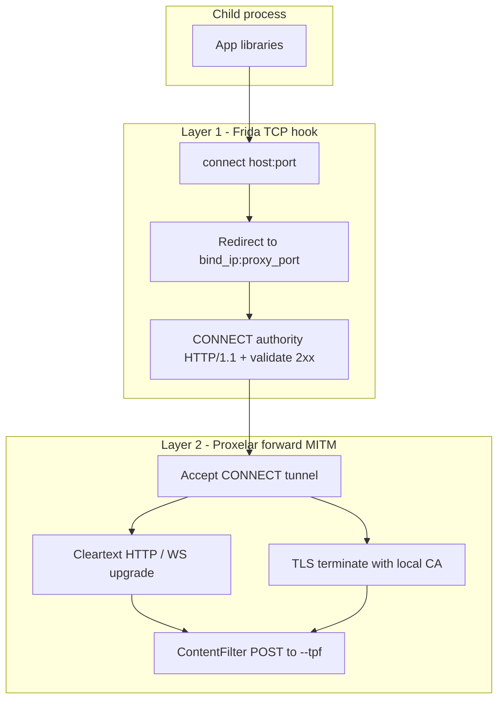

# Guardian — agent and contributor guide

Cross-platform Rust CLI that hardens AI harnesses: optional Frida `connect()` hooking + embedded [Proxelar](https://github.com/emanuele-em/proxelar) MITM when `--tpf` is set, and direct payload filtering for tool calls.

## Modes

| Mode | Invocation | `--tpf` absent | `--tpf` present |
|------|------------|----------------|-----------------|
| MITM | `guardian -- <program>` | Passthrough exec (no Frida/proxy) | Frida hook + proxy + response/frame filter |
| Payload | `--payload` or piped stdin | Echo payload to stdout | POST to filter; print response or block |

Piped stdin (non-TTY, not `/dev/null`) or `--payload` selects payload mode only; a child program after `--` is invalid in that case and is rejected. MITM harnesses should use `stdin: 'ignore'` / `Stdio::null()`.

## Goal

`guardian --tpf URL -- curl https://httpbin.org/get` should MITM-intercept HTTP/HTTPS/WS/WSS, POST each response (or server→client WS frame) to the filter URL, and block unsafe content before it reaches the harness.

## Protocol interception (MITM + `--tpf` only)

Two-layer design; scheme names are not parsed by Frida — interception is driven by TCP destinations, then protocol decoding in Proxelar.



**Layer 1** — hook `connect()` / `WSAConnect` for **TCP only** (IPv4 and IPv6); redirect to `bind_ip:proxy_port` (IPv6 destinations use an IPv4-mapped proxy address `::ffff:bind_ip`); synthetic `CONNECT authority HTTP/1.1` with `Host` only; read and require a `2xx` CONNECT response (fail-closed on error/timeout). Loopback and unspecified destinations bypass the hook in JS (`127/8`, `0.0.0.0`, `::1`, `::`, and IPv4-mapped forms only — not private ranges). Default filter: TCP except `ignored_ports`. `--filter` receives `host` from DNS resolution (`__guardianHostByIp`); use native JS regex on `host` for domain rules. Client ALPN is not modified — h2/http/1.1 negotiate as the client offers. Process shutdown uses `kill_tree` on the Frida-spawned tree; root exit is detected via Frida `child-removed`, not `kill(pid,0)` or session detach alone.

**Layer 2** — `ProxyMode::Forward`, `content_filter: TrypanophobeClient`, `event_tx: None`. Each leg negotiates HTTP version via ALPN (h2 or http/1.1) with no forced downgrade. Finite HTTP responses (including chunked and bodies without `Content-Length`) are buffered and checked once. Only `text/event-stream` (SSE) is gated per event (fail-closed: an event reaches the harness only after `--tpf` returns `200`). Server→client WS `Text`/`Binary` frames checked.

## Startup lifecycle (MITM + `--tpf`)

```text
main (tokio)
 ├─ resolve Settings
 ├─ CaTrust + prepare_mitm_ca (rotate unless install-system or --skip-cert-regen)
 ├─ spawn_blocking: frida spawn → port → proxy ready → instrument → wait
 ├─ proxy with ContentFilter (no JSONL)
 └─ exit(normalize_exit_code)
```

Payload mode: `trypanophobe::run_payload` — read stdin/`--payload`, optional POST to `--tpf`.

## Repository layout

```
guardian/
  src/
    main.rs              # mode dispatch
    trypanophobe.rs      # filter client + payload runner
    proxy.rs             # Proxelar embed + ContentFilter
    injector.rs          # Frida
    ca.rs
    bin/
      http_smoke.rs      # signed MITM smoke client (mac/win; curl elsewhere)
      sleep_smoke.rs     # Frida-safe sleep helper for interrupt smoke
  patches/proxyapi+0.4.5.patch   # SNI cert, Connection: close, ContentFilter, TPS swap
  scripts/
    smoke.zx.ts          # npm run smoke entry
    test-servers.ts      # Fastify HTTP/1.1, HTTP/2, h2c, SSE, TPF mock (smoke + integration)
    build-*-smoke.zx.ts  # release build + platform smoke helpers (mac codesign)
    smoke/
      cases.ts           # passthrough smoke cases
      tpf-cases.ts       # MITM + TPF matrix
      run-tpf-cases.ts
      platform.ts        # per-OS child binaries (curl, http-smoke, sleep)
```

## Trypanophobe API

Reference backend: [Sparse-Dynamix/trypanophobe](https://github.com/Sparse-Dynamix/trypanophobe). Set `--tpf` to the full filter path (e.g. `http://127.0.0.1:8080/api/filter`).

Guardian `POST`s **raw bytes** as the body with:

- **`url` query (required)** — source URL (`http(s)://…` for HTTP responses, `guardian://payload` for tool payloads, WebSocket upgrade URL or `guardian://websocket/…` for WS frames)
- **`format` query** — omitted (default `og`) unless `--tps` is set, then `format=md`
- **`Content-Type` header** — upstream response type, SSE `text/event-stream`, or payload `application/octet-stream`

Responses:

- **`200`** — allow (forward original unless `--tps`)
- **`206`** — partial safe markdown (`format=md` + `--tps` only)
- **`406`** — block; JSON `error`, `stage`, `reason`, `detail` formatted into an explicit user-facing message
- **Other statuses** — block with configured `block_message` fallback

With `--tps` / `trypanophobe_swap`, allowed `200`/`206` response bodies and headers replace what the harness sees.

## Build

**Prerequisites:** Rust stable, Node.js (`npm install`), `libclang-dev` (Linux).

```bash
npm install
cargo run --quiet --manifest-path tools/patch-proxyapi/Cargo.toml
cargo build --release
```

## Contributing

- **Commit messages** — use [Conventional Commits](https://www.conventionalcommits.org/) (`feat:`, `fix:`, `chore:`, etc.).
- **Before pushing** — run `npm run format` (Biome for JS/TS, `cargo fmt` for Rust).

## Testing

**Cargo integration** — real Frida/proxy where needed; payload echo tests without network. Integration tests spawn `scripts/test-servers.ts` via `tests/common/mod.rs` (no remote httpbin/httpbingo).

**Local test servers** — Fastify + `@fastify/sse`. Origin servers bind `0.0.0.0`; MITM smoke targets use `firstNonLoopbackIPv4()` so loopback bypass (`127/8`) is exercised separately via `loopbackGetUrl`. TPF mock binds loopback only.

**Smoke helpers** — `guardian-http-smoke` (Rust curl replacement for mac/win Frida attach) and `guardian-sleep` (interrupt teardown). macOS builds ad-hoc-sign them in `scripts/build-mac-smoke.zx.ts`.

**Smoke** — `npm run smoke` patches, builds release artifacts, starts test servers, runs passthrough + TPF cases.

```bash
npm run smoke
```

TPF mock: `POST /api/filter?url=…` — `200` pass; `?mock=reject` → `406` JSON; `?mock=swap` + `format=md` → markdown swap; `?mock=partial` → `206` partial markdown.

**Coverage** — `npm run coverage` on linux x64, mac x64, and win x64 (90% line gate). Ignore patterns live in `scripts/lib/coverage.ts` (path-separator agnostic for Windows `bin\…` paths). aarch64 CI jobs run smoke + pack only.

**WSS** — `tests/websocket.rs` is `#[ignore]` until test-servers serves local WSS echo.

## Configuration reference

| Key | CLI | Env | Default | Description |
|-----|-----|-----|---------|-------------|
| `trypanophobe_filter` | `--tpf` | `GUARDIAN_TRYPANOPHOBE_FILTER` | (unset) | Filter endpoint URL |
| `bind` | `-b, --bind` | `GUARDIAN_BIND` | `127.0.0.1` | Proxy bind IPv4 |
| `port` | `-p, --port` | `GUARDIAN_PORT` | (unset) | Fixed proxy port |
| `filter` | `--filter` | `GUARDIAN_FILTER` | denylist | Connect-hook JS (`sa_family`, `addr`, `port`, `host`) |
| `ignored_ports` | `--ignored-ports` | — | see toml | Ports left unhooked when `--filter` is unset |
| `trypanophobe_swap` | `--tps` | — | `false` | Swap TPF 200 body/headers into harness (requires `--tpf`) |
| `ca_dir` | `--ca-dir` | `GUARDIAN_CA_DIR` | `~/.guardian` | CA directory |
| `skip_cert_regen` | `--skip-cert-regen` | `GUARDIAN_SKIP_CERT_REGEN` | `false` | Reuse on-disk CA; default rotates each MITM run unless `install-system` |
| `filter_timeout_secs` | — | `GUARDIAN_FILTER_TIMEOUT_SECS` | `10` | Filter HTTP timeout |
| `block_message` | — | `GUARDIAN_BLOCK_MESSAGE` | see toml | Substitution text on block |
| `upstream_tls` | — | `GUARDIAN_UPSTREAM_TLS` | `default` | Upstream TLS trust: `default`, `default+ca:/path`, `ca-only:/path`, or `insecure` |

Shipped defaults: [`config/guardian.toml`](config/guardian.toml).

## Release binaries (nightly)

`.github/workflows/nightly.yml` builds five targets on every push to `main`:

| Job | Smoke | Coverage (90% lines) | Pack |
|-----|-------|----------------------|------|
| linux x64 | yes | yes | yes |
| linux aarch64 | yes | — | yes |
| mac x64 | yes | yes | yes |
| mac aarch64 | yes | — | yes |
| win x64 | yes | yes | yes |

The `release` job uploads all archives to the [`nightly`](https://github.com/Sparse-Dynamix/guardian/releases/tag/nightly) tag (`guardian-{version}-{platform}-{arch}.tar.gz` or `.zip` on Windows).

Archive naming: `guardian-{version}-{platform}-{arch}` (e.g. `guardian-1.0.0-beta-linux-aarch64.tar.gz`).

| Archive contents | Linux / Windows | macOS |
|------------------|-----------------|-------|
| `guardian` / `guardian.exe` | yes | yes |
| `LICENSE`, `NOTICE.txt` | yes | yes |
| `entitlements.plist` | — | yes |

**Embedded at link time (not separate files in the archive):**

- **Frida Core** — `frida` + `frida-sys` with `auto-download` download the official devkit (`libfrida-core.a` / static Windows import lib) and link it into the binary. The devkit does not ship a loadable `.so` / `.dylib` / `.dll` for this build mode.
- **mkcert** — embedded by `build.rs` for `install-system` / `remove-system`.

End-user docs: [README.md](README.md#1-download).

## Known limitations

- Certificate pinning blocks MITM
- IPv6 `connect()` uses IPv4-mapped redirect to the proxy bind address; sockets with `IPV6_V6ONLY` to literal v6 destinations may bypass interception
- Frida permissions required
- Non-HTTP TCP tunneled but not filtered
- QUIC/UDP not intercepted
- Gated streaming adds ~one `--tpf` round-trip of latency per SSE event/chunk
