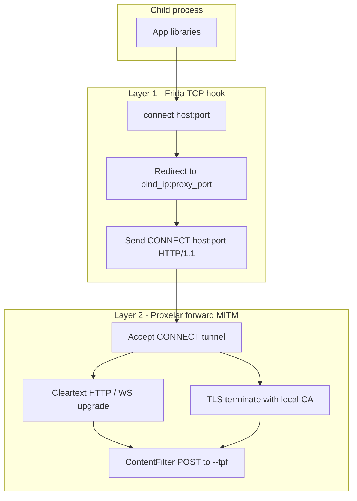

# Guardian — agent and contributor guide

Cross-platform Rust CLI that hardens AI harnesses: optional Frida `connect()` hooking + embedded [Proxelar](https://github.com/emanuele-em/proxelar) MITM when `--tpf` is set, and direct payload filtering for tool calls.

## Modes

| Mode | Invocation | `--tpf` absent | `--tpf` present |
|------|------------|----------------|-----------------|
| MITM | `guardian -- <program>` | Passthrough exec (no Frida/proxy) | Frida hook + proxy + response/frame filter |
| Payload | `--payload` or piped stdin | Echo payload to stdout | POST to filter; print response or block |

Piped stdin (non-TTY, not `/dev/null`) or `--payload` selects payload mode only; a child program after `--` is invalid in that case and is rejected. MITM harnesses should use `stdin: 'ignore'` / `Stdio::null()`.

## Goal

`guardian --tpf URL -- curl https://httpbin.org/get` should MITM-intercept HTTP/HTTPS/WS/WSS, POST each response (or server→client WS frame) to the filter URL, and block unsafe content before it reaches the harness.

## Protocol interception (MITM + `--tpf` only)

Two-layer design; scheme names are not parsed by Frida — interception is driven by TCP destinations, then protocol decoding in Proxelar.



**Layer 1** — hook `connect()` / `WSAConnect` for **TCP only** (IPv4 and IPv6); redirect to `bind_ip:proxy_port` (IPv6 destinations use an IPv4-mapped proxy address `::ffff:bind_ip`); synthetic `CONNECT host:port HTTP/1.1` with `Proxy-Connection: Keep-Alive`. Default filter: TCP except `ignored_ports`. `--filter` receives `host` from DNS resolution (`__guardianHostByIp`); use native JS regex on `host` for domain rules. Client ALPN is not modified — h2/http/1.1 negotiate as the client offers.

**Layer 2** — `ProxyMode::Forward`, `content_filter: TrypanophobeClient`, `event_tx: None`. Each leg negotiates HTTP version via ALPN (h2 or http/1.1) with no forced downgrade. Finite HTTP responses (including chunked and bodies without `Content-Length`) are buffered and checked once. Only `text/event-stream` (SSE) is gated per event (fail-closed: an event reaches the harness only after `--tpf` returns `200`). Server→client WS `Text`/`Binary` frames checked.

## Startup lifecycle (MITM + `--tpf`)

```text
main (tokio)
 ├─ resolve Settings
 ├─ CaTrust + Ssl::load_or_generate
 ├─ spawn_blocking: frida spawn → port → proxy ready → instrument → wait
 ├─ proxy with ContentFilter (no JSONL)
 └─ exit(normalize_exit_code)
```

Payload mode: `trypanophobe::run_payload` — read stdin/`--payload`, optional POST to `--tpf`.

## Repository layout

```
guardian/
  src/
    main.rs           # mode dispatch
    trypanophobe.rs   # filter client + payload runner
    proxy.rs          # Proxelar embed + ContentFilter
    injector.rs       # Frida
    ca.rs
  patches/proxyapi+0.4.5.patch   # SNI cert, Connection: close, ContentFilter, TPS swap
  scripts/smoke/
    test-servers.ts      # consolidated local HTTP/HTTP2/SSE/IPv6 + TPF mock (smoke + integration tests)
    tpf-cases.ts
    run-tpf-cases.ts
```

## Trypanophobe API

POST **raw bytes** to `--tpf` URL. HTTP responses add `?url=<request-url>` only. `200` = allow; any other status = block (fail closed). With `--tps` / `trypanophobe_swap`, a `200` response body and headers replace what the harness sees.

## Build

**Prerequisites:** Rust stable, Node.js (`npm install`), `libclang-dev` (Linux).

```bash
npm install
cargo run --quiet --manifest-path tools/patch-proxyapi/Cargo.toml
cargo build --release
```

## Testing

**Cargo integration** — real Frida/proxy where needed; payload echo tests without network.

**Smoke** — `npm run smoke` builds release artifact, starts consolidated test servers (`scripts/test-servers.ts`), runs passthrough + TPF cases.

```bash
npm run smoke
```

TPF mock endpoints: `POST /pass` → 200 empty; `POST /reject` → 503; `POST /swap` → 200 `SWAPPED_BODY`; `POST /image-swap` → 200 markdown (PNG body in POST).

## Configuration reference

| Key | CLI | Env | Default | Description |
|-----|-----|-----|---------|-------------|
| `trypanophobe_filter` | `--tpf` | `GUARDIAN_TRYPANOPHOBE_FILTER` | (unset) | Filter endpoint URL |
| `bind` | `-b, --bind` | `GUARDIAN_BIND` | `127.0.0.1` | Proxy bind IPv4 |
| `port` | `-p, --port` | `GUARDIAN_PORT` | (unset) | Fixed proxy port |
| `filter` | `--filter` | `GUARDIAN_FILTER` | denylist | Connect-hook JS (`sa_family`, `addr`, `port`, `host`) |
| `ignored_ports` | `--ignored-ports` | — | see toml | Ports left unhooked when `--filter` is unset |
| `trypanophobe_swap` | `--tps` | — | `false` | Swap TPF 200 body/headers into harness (requires `--tpf`) |
| `ca_dir` | `--ca-dir` | `GUARDIAN_CA_DIR` | `~/.guardian` | CA directory |
| `filter_timeout_secs` | — | `GUARDIAN_FILTER_TIMEOUT_SECS` | `10` | Filter HTTP timeout |
| `block_message` | — | `GUARDIAN_BLOCK_MESSAGE` | see toml | Substitution text on block |
| `upstream_tls` | — | `GUARDIAN_UPSTREAM_TLS` | `default` | Upstream TLS trust: `default`, `default+ca:/path`, `ca-only:/path`, or `insecure` |

Shipped defaults: [`config/guardian.toml`](config/guardian.toml).

## Known limitations

- Certificate pinning blocks MITM
- IPv6 `connect()` uses IPv4-mapped redirect to the proxy bind address; sockets with `IPV6_V6ONLY` to literal v6 destinations may bypass interception
- Frida permissions required
- Non-HTTP TCP tunneled but not filtered
- QUIC/UDP not intercepted
- Gated streaming adds ~one `--tpf` round-trip of latency per SSE event/chunk
