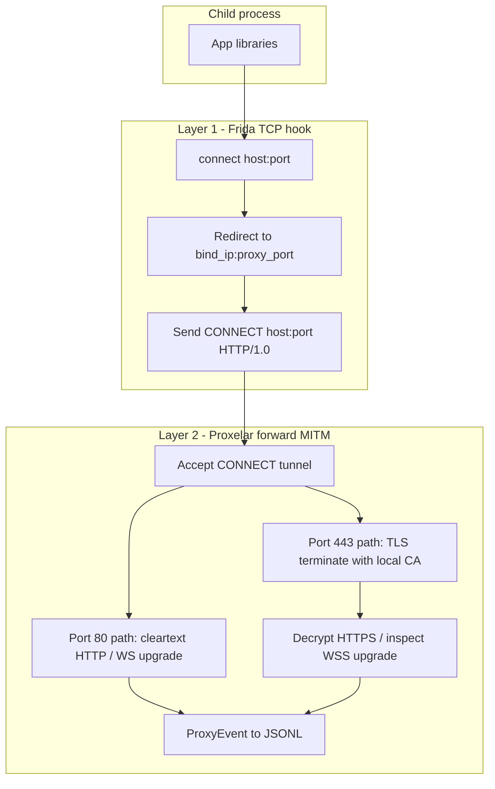
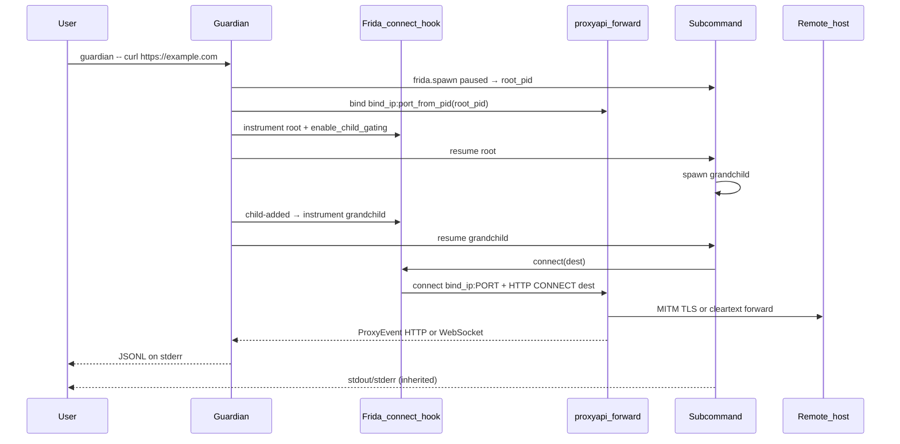

# Guardian: cross-platform Frida + Proxelar network wrapper

## Goal

`guardian -- curl https://httpbin.org/get` should MITM-intercept and log traffic for **all four web schemes**:

| Scheme | Typical port | How it is intercepted |
|--------|--------------|------------------------|
| **HTTP** | 80 (any) | `connect()` → local proxy → `CONNECT host:port` tunnel → Proxelar parses cleartext HTTP |
| **HTTPS** | 443 (any) | same TCP redirect → Proxelar terminates TLS with generated per-host cert (MITM) → decrypts HTTP inside |
| **WS** | 80 (any) | cleartext HTTP `Upgrade: websocket` → `ProxyEvent::WebSocketConnected` + frames |
| **WSS** | 443 (any) | TLS MITM first, then WebSocket upgrade inside decrypted connection → same WS events |

Concrete smoke targets for this pass:

```bash
guardian -- curl http://httpbin.org/get          # HTTP
guardian -- curl https://httpbin.org/get         # HTTPS (CA injected into child env)
guardian -- websocat -t ws://echo.websocket.events   # WS
guardian -- websocat -t wss://echo.websocket.events  # WSS
```

Steps:

1. Spawn the subcommand **paused** via Frida and read its **PID**
2. Resolve the proxy listen port: **PID-based auto** in `[1024, 65535]` by default, or **`--port` / config override** when set (skips auto algorithm, binds exactly that port)
3. Start the embedded **forward MITM** proxy (Proxelar `proxyapi`, `ProxyMode::Forward`) on `<bind_ip>:<port>` (default `127.0.0.1`)
4. Inject a Frida script into the subcommand **and any child processes it spawns** (Frida child gating), redirecting **all hooked IPv4 TCP `connect()` calls** to that port via synthetic `HTTP CONNECT` (fritm pattern)
5. Auto-inject Proxelar root CA into child env via exhaustive trust env vars (mkcert-inspired [`ca.rs`](src/ca.rs)) so **HTTPS/WSS** work without manual setup
6. Resume the child with inherited stdout/stderr
7. Stream MITM traffic as **JSONL** on **stderr** (one JSON object per line; child **stdout** stays clean for piping); each `ProxyEvent` emitted as it arrives (including live WebSocket frames); `--silent` suppresses JSONL; internal `tracing` off unless `-v` / `RUST_LOG`
8. Exit with the child’s exit code (normalized cross-platform); proxy listener is released with the process

Long-term direction: proxychains-compatible CLI using Frida injection + Proxelar MITM.

## Protocol interception (HTTP / HTTPS / WS / WSS)

Guardian uses a **two-layer** design; scheme names (`http://`, `wss://`, etc.) are not parsed by Frida — interception is driven by **TCP destinations** the child dials, then **protocol decoding** in Proxelar.



**Layer 1 — universal TCP capture (Frida)**

- Hook `connect()` in libc / `ws2_32.dll` (and `WSAConnect` on Windows — see platform parity); **do not** hardcode ports 80/443 — apps may use `:8080`, `:3000`, `:8443`, etc.
- **Platform-default `--filter`** (overridable via CLI/config):
  - **Linux/macOS**: `sa_family == 2 || sa_family == 0` (IPv4 + Windows-style quirk on some libc paths)
  - **Windows**: `true` (`sa_family` is often `0` on Winsock; fritm parity)
  - Implemented via `cfg!(target_os = "windows")` when CLI/config `filter` is unset — do **not** ship a single static filter in example toml for all OSes
- Redirect sockaddr to **`BIND_HOST` from `--bind`** (four IPv4 octets templated into `connect_hook.js`; must match proxy listen address)
- Every hooked connection is presented to Proxelar as an HTTP `CONNECT` tunnel to the original `host:port` (fritm technique works for any TCP port)

**Layer 2 — HTTP-family MITM (Proxelar `proxyapi`)**

- **`ProxyMode::Forward`** only (no reverse mode in v1): handles `CONNECT`, performs TLS interception for TLS-bearing connections, decodes HTTP/1.x (and HTTP/2 where Proxelar supports it on the connection)
- **HTTP**: request/response visible as `ProxyEvent::RequestComplete`
- **HTTPS**: Proxelar mints per-host certs signed by `ca_dir` root; child trusts root via auto-injected env vars from [`ca.rs`](src/ca.rs) (see CA trust section)
- **WS**: cleartext `Upgrade: websocket` → `WebSocketConnected` / `WebSocketFrame` / `WebSocketClosed`
- **WSS**: TLS MITM on the tunnel first, then same WebSocket event pipeline on the decrypted stream

**What is explicitly in scope for MITM + logging this pass**

- `http://` and `https://` REST/API traffic (any host, any port the app connects to)
- `ws://` and `wss://` including **live** frame streaming in JSONL
- Non-standard ports (e.g. `https://localhost:8443`, `ws://localhost:9001`) as long as the app uses `connect()` to reach them

**What remains out of scope (document, do not block v1)**

- Raw non-HTTP TCP (databases, custom protocols): tunneled through CONNECT but not logged in JSONL
- Certificate pinning / custom trust stores that ignore injected CA
- IPv6 destinations (fritm parity gap)
- UDP / QUIC (not handled by `connect()` hook)

## Architecture



**Key design choices**

| Area | Choice | Rationale |
|------|--------|-----------|
| MITM engine | Crate dep `proxyapi` / `proxyapi_models` (v0.4.x) | Single binary; same engine as [Proxelar](https://github.com/emanuele-em/proxelar) |
| Injection | `frida` crate v0.17 + `auto-download` | Avoid manual devkit install; matches [frida-rust](https://github.com/frida/frida-rust) |
| Child processes | Frida **child gating** on every instrumented session | Subcommands that `fork`/`exec`/`CreateProcess` descendants get the same `connect()` hook |
| Hook technique | Port [fritm `script.js`](https://github.com/louisabraham/fritm/blob/master/fritm/script.js) | Proven `connect()` redirect + synthetic `CONNECT` header |
| Async model | `tokio` runtime + `spawn_blocking` for Frida | Frida APIs are sync; Proxelar is async |
| MITM logs | Streaming JSONL on stderr | Child stdout pipeable; lines start with `{`; `--silent` skips JSONL |
| Diagnostics | `tracing` → stderr, prefixed | Off unless `-v` / `RUST_LOG`; `guardian: ` prefix |
| Proxy port | PID-derived by default; `--port` overrides | Auto avoids collisions across concurrent runs; override for debugging or fixed setups |

## Proxy port allocation

The listen port is resolved **after** `frida.spawn` returns the child **PID** and **before** the hook is loaded, so injected `PORT` always matches the bound listener.

**Two modes** (CLI / config `port` field):

| Mode | When | Behavior |
|------|------|----------|
| **Auto** (default) | `--port` omitted and config `port` unset | PID-based primary + linear probe (below) |
| **Override** | `--port N` or config `port = N` | Bind exactly `N`; fail with clear error if unavailable (no probe to other ports) |

Override is useful for debugging or pinning the proxy; auto is the default for concurrent `guardian` invocations.

### Auto algorithm (default)

**Constants**

- `MIN_PORT = 1024` (IANA user port range floor; no privileged ports)
- `MAX_PORT = 65535` (fixed constant; not configurable)
- `PORT_SPAN = MAX_PORT - MIN_PORT + 1` (= 64512)

**Primary mapping** (deterministic per child):

```text
primary(pid) = MIN_PORT + (pid mod PORT_SPAN)
```

Examples: PID `12345` → `1024 + (12345 mod 64512)` = `13369`; PID `99999` wraps within the range.

**Collision handling** (linear probe):

Concurrent guardian processes usually get different child PIDs → different `primary` values. If `primary` is already bound (stale listener, PID reuse race, or hash collision), probe forward with wraparound:

```text
for attempt in 0..PORT_SPAN:
    port = MIN_PORT + ((pid mod PORT_SPAN + attempt) mod PORT_SPAN)
    if bind(127.0.0.1, port) succeeds → use port
else → error "no free port in [1024, 65535]"
```

Implement in [`src/port.rs`](src/port.rs):

```rust
pub const MIN_PORT: u16 = 1024;
pub const MAX_PORT: u16 = 65535;

pub fn primary_port(pid: u32) -> u16 { ... }

pub fn allocate_port_auto(pid: u32, bind_ip: IpAddr) -> Result<u16> { ... }

pub fn resolve_listen_port(
    pid: u32,
    bind_ip: IpAddr,
    port_override: Option<u16>,
) -> Result<u16> {
    match port_override {
        Some(p) => {
            validate_range(p)?;  // 1024 <= p <= MAX_PORT
            bind_or_error(bind_ip, p)  // EADDRINUSE → "port {p} already in use"
        }
        None => allocate_port_auto(pid, bind_ip),
    }
}
```

`validate_range`: `1024 <= port <= 65535`. `resolve_listen_port` runs the probe loop only in auto mode. The proxy task binds **immediately** on the returned port so no TOCTOU gap exists between probe and `Proxy::start`.

**Startup order** (CA before spawn; port depends on PID):

```text
1. CaTrust::from_ca_dir(ca_dir)
2. Ssl::load_or_generate(ca_dir)     (Proxelar CA PEM — before proxy listener)
3. ca_trust.ensure_artifacts()       (guardian-ca-bundle.pem, optional Java truststore)
4. frida.spawn(program, env=ca_vars) → root_pid   (child suspended)
5. port = resolve_listen_port(root_pid, bind_ip, override)
6. start proxy on bind_ip:port       (async task; await listener ready)
7. attach(root_pid), load connect_hook.js + env_inject.js
8. resume(root_pid)
9. wait for child exit, shutdown proxy
```

## Repository layout (greenfield)

The repo is empty aside from README/LICENSE. Add:

```
guardian/
  Cargo.toml
  build.rs                 # optional: embed script, set rpath for libfrida
  rust-toolchain.toml
  .cargo/config.toml
  assets/connect_hook.js     # adapted from fritm; PORT, FILTER, BIND_HOST octets
  assets/env_inject.js       # execve/posix_spawn/CreateProcessW CA env append
  src/
    main.rs                  # clap entry, tokio main
    config.rs                # config-rs layering
    cli.rs                   # clap structs
    port.rs                  # PID → listen port + linear-probe allocator
    proxy.rs                 # start/stop embedded proxyapi on allocated port
    injector.rs              # spawn, instrument(), child gating, process-tree wait
    frida_ext.rs             # enable_child_gating + Device child-added signals (frida_sys)
    jsonl.rs                 # ProxyEvent -> JSONL lines on stderr
    ca.rs                    # child env for Proxelar CA trust
  config/guardian.toml       # example defaults
  scripts/
    build-local.sh
    build-release.sh         # zigbuild + xwin cross-compile (local/self-hosted)
```

## Core modules

### 1. CLI ([clap](https://github.com/clap-rs/clap))

```text
guardian [OPTIONS] -- <PROGRAM> [ARGS]...
```

| Flag | Purpose | Default |
|------|---------|---------|
| `--silent` | Suppress JSONL network log lines on stderr | off |
| `-p, --port` | Proxy listen port; **overrides** PID auto-allocation when set (`1024..=65535`) | auto (unset) |
| `-b, --bind` | Proxy bind IPv4 address (also `BIND_HOST` in connect hook) | `127.0.0.1` |
| `--ca-dir` | Proxelar CA directory | `~/.proxelar` |
| `--body-limit` | Max request/response/WS frame bytes captured; JSONL preview truncated to this length | `256` |
| `--filter` | JS expression (`sa_family`, `addr`, `port`) | platform default (see below) |
| `--config` | Config file path | optional |
| `-v` / `RUST_LOG` | Internal `tracing` to stderr (prefixed `guardian:`) | off (no output unless set) |

Use `#[command(trailing_var_arg = true)]` + `allow_hyphen_values` so `guardian -- myapp --flag` works.

### 2. Config ([config-rs](https://github.com/rust-cli/config-rs))

Layered sources (lowest → highest precedence):

1. `config/guardian.toml` (shipped example)
2. `~/.config/guardian/guardian.toml` (or platform equivalent via `dirs`)
3. `guardian.toml` in cwd
4. env `GUARDIAN_*` (e.g. `GUARDIAN_PORT`, `GUARDIAN_BODY_LIMIT`)
5. CLI flags

Example [`config/guardian.toml`](config/guardian.toml):

```toml
bind = "127.0.0.1"
# port = 8080   # optional; omit for PID-based auto allocation (must be 1024..=65535)
body_limit = 256
# filter — omit to use platform default (IPv4 on Unix, true on Windows)
# filter = "sa_family == 2 || sa_family == 0"
ca_dir = "~/.proxelar"
silent = false
```

Deserialize into a `Settings` struct shared by CLI + runtime. Resolve `filter: Option<String>` — `None` triggers `default_filter()` in [`cli.rs`](src/cli.rs):

```rust
pub fn default_filter() -> &'static str {
    if cfg!(target_os = "windows") { "true" }
    else { "sa_family == 2 || sa_family == 0" }
}
```

Validate `--bind` is a parseable **IPv4** address (v1); reject IPv6 bind until hook supports it.

### 3. Embedded proxy ([`proxyapi`](https://docs.rs/proxyapi))

Mirror [`proxelar-cli/src/main.rs`](https://github.com/emanuele-em/proxelar/blob/main/proxelar-cli/src/main.rs):

- Install rustls ring provider
- **`ProxyMode::Forward`** — required for CONNECT-based MITM of HTTP, HTTPS, WS, and WSS from hooked clients
- `ProxyConfig { mode: Forward, intercept: None, body_capture_limit: Some(body_limit), ca_dir, upstream_tls: Default, ... }`
- Call `Ssl::load_or_generate(ca_dir)` in guardian startup **before** `frida.spawn` (shared with `CaTrust::ensure_artifacts`); proxy listener starts after port resolution
- `body_capture_limit` applies to HTTP bodies and WebSocket frame payloads
- `mpsc::channel` for `ProxyEvent` (HTTP + WebSocket variants)
- `Proxy::start(cancel.cancelled_owned())` on a tokio task
- **`SocketAddr` port from `resolve_listen_port(child_pid, bind_ip, settings.port)`** — auto when unset; never OS ephemeral (`0`)

No TUI/GUI/lua scripting in v1. Do **not** use reverse-proxy mode for v1 — it does not match the fritm CONNECT injection model.

### 4. Frida injector ([`frida`](https://docs.rs/frida))

Based on fritm [`hook.py`](https://github.com/louisabraham/fritm/blob/master/fritm/hook.py), frida-rust [`console_log`](https://github.com/frida/frida-rust/blob/main/examples/core/console_log/src/main.rs), and Frida [child gating](https://frida.re/news/2018/04/28/frida-10-8-released/) ([Python example](https://github.com/frida/frida-python/blob/main/examples/child_gating.py)).

**Scope**: Hook the spawned subcommand **and any descendant processes it creates** (e.g. `guardian -- bash -c 'curl https://example.com'`, `make`, `npm run`, language runtimes that re-exec). All hooked processes share the **same proxy port** and `connect_hook.js`.

```rust
// Pseudocode — spawn_blocking in injector.rs
let ca_trust = CaTrust::from_ca_dir(&settings.ca_dir)?;
ca_trust.ensure_artifacts()?;  // bundle + optional Java store

let device = device_manager.get_device_by_type(DeviceType::Local)?;
device.on_child_added(|child| instrument(child.pid));  // frida_sys GObject signal

let options = SpawnOptions::new()
    .argv(args)
    .stdio(SpawnStdio::Inherit)
    .env(ca_trust.env_for_child(&parent_env));
let root_pid = device.spawn(program, &mut options)?;  // suspended
let port = resolve_listen_port(root_pid, bind_ip, port_override)?;
// ... callback: start proxy on bind_ip:port, await listener ready ...

instrument(root_pid)?;

fn instrument(pid: u32) -> Result<()> {
    let session = device.attach(pid)?;
    session.enable_child_gating()?;  // thin wrapper — see below
    load_scripts(&session, &hook_bundle)?;  // connect_hook.js + env_inject.js
    device.resume(pid)?;
    sessions.insert(pid, session);
    Ok(())
}

let status = wait_for_process_tree(root_pid, &sessions)?;
```

`hook_bundle` is built once per run: `PORT`, `FILTER`, `BIND_HOST` (four octets), `CA_ENV_JSON` (array of `"KEY=value"` strings from `CaTrust`).

**Child process gating** (required for subprocess coverage)

Frida’s child gating pauses descendant processes at birth so guardian can attach and inject **before they run user code** ([handbook](https://learnfrida.info/intermediate_usage/)):

1. On every `instrument(pid)`: `session.enable_child_gating()` after attach
2. Register `Device` **`child-added`** handler before resuming the root process
3. On `child-added`: call `instrument(child.pid)` recursively (same `port`, same script, enable gating on the new session)
4. On `child-removed`: detach session / remove from tracked set
5. Handle `origin=exec` **process replacement** on the same PID (re-attach when session detaches with `process-replaced`)

OS coverage ([Frida handbook](https://learnfrida.info/intermediate_usage/)):

| OS | Detected spawn primitives |
|----|---------------------------|
| Linux | `fork()`, `vfork()` |
| macOS | `fork()`, `posix_spawn`, `exec` follow-up |
| Windows | `CreateProcessInternalW` |

**frida-rust gap**: upstream `Session` does not yet expose `enable_child_gating()` or `Device` child signals. Add a small **`src/frida_ext.rs`** (or `injector/child_gating.rs`) calling `frida_sys::frida_session_enable_child_gating` and connecting `child-added` via GObject signals on `_FridaDevice`. Keep wrappers local to guardian for v1; upstream PR optional later.

**`Instrumentor` state** (in [`injector.rs`](src/injector.rs)):

- `port: u16` — fixed for the whole guardian run (one proxy, many hooked PIDs)
- `sessions: HashMap<u32, Session>` — all attached processes
- `hook_source: String` — templated `connect_hook.js` built once
- `ca_trust: CaTrust` — root spawn env + `CA_ENV_JSON` embedded in every session’s `env_inject.js`
- `hook_bundle: HookBundle` — templated `connect_hook.js` + `env_inject.js` sources

**Waiting for exit**: `wait_for_process_tree(root_pid)` blocks until the **root** process exits. Normalize exit status cross-platform: Unix `WEXITSTATUS`; Windows `DWORD` → `i32` (document that values `> 255` may truncate when surfaced as Unix-style exit codes). Child sessions detached on `child-removed` or shutdown. All gated children must be **resumed** after instrumentation or they hang.

**`assets/connect_hook.js`**: Start from fritm; keep Windows recv retry loop; template `PORT`, `FILTER`, and `BIND_HOST` (replace hardcoded `127.0.0.1` octets). Document IPv6 as known limitation.

**`assets/env_inject.js`** — exec-child CA injection (Frida cannot patch `child-added` envp from Rust)

Frida’s `child-added` exposes `envp` read-only. For `origin=exec` / fresh process environments, inject CA vars **in-process** before the new image runs by hooking OS spawn/exec APIs and appending `CA_ENV_JSON` entries (skip keys already present):

| OS | Hook targets | Strategy |
|----|--------------|----------|
| **Linux** | `execve`, `execveat` (+ `execvp`/`execvpe` if present) | On enter: read `envp` char\*\*; allocate new env block with guardian `KEY=value` pairs appended; replace pointer arg |
| **macOS** | `posix_spawn`, `posix_spawnp` (+ `execve` for bare exec follow-ups) | Patch `envp` / `file_actions` env builder similarly; handle `*_np` variants where exported |
| **Windows** | `CreateProcessW` (and `CreateProcessA` for narrow builds) | If `lpEnvironment` is null, build inherited+guardian block; if non-null, merge guardian pairs into existing `WCHAR` env block before call |

Implementation notes:

- Embed `const CA_ENV = [...]` at script compile time from Rust (`CaTrust::env_pairs_for_injection()`)
- Helper `mergeEnv(existing, caPairs)` — parse `KEY=value` arrays; **do not overwrite** existing keys
- Load `env_inject.js` in **every** `instrument()` call (root + all child-gated PIDs) before `resume`
- `fork()`-only children inherit root spawn env — hooks are belt-and-suspenders for subsequent `exec`
- Unit-test merge logic in Rust; integration-test `guardian -- sh -c 'env | grep REQUESTS_CA_BUNDLE'`

**Platform notes (v1)**

- Linux/macOS: hook `connect` from libc
- Windows: hook `connect` + **`WSAConnect`** in `ws2_32.dll` (same redirect logic; some apps use Winsock2 entry point only)
- Linux: spawn same-user works at default `ptrace_scope=1`; root or `sysctl …=0` needed at scope 2, for other users, setuid targets, or Docker default seccomp
- macOS: `task_for_pid` via taskgate (or `system.privilege.taskport` over SSH); SIP blocks platform binaries; Hardened Runtime blocks agent load without `disable-library-validation`
- Windows: match integrity level (run guardian elevated to wrap elevated children); PPL/AV block injection; ship `frida-core` DLL beside `guardian.exe`
- WSL2: injects Linux ELF only — document that Windows `.exe` children from WSL are out of scope

### 4b. CA trust automation ([`ca.rs`](src/ca.rs)) — mkcert-inspired

Goal: users run `guardian -- curl https://example.com` with **zero manual CA steps**. Pattern inspired by [mkcert](https://github.com/FiloSottile/mkcert)’s `CAROOT` + `NODE_EXTRA_CA_CERTS` approach, but guardian injects trust into the **child process environment** (not host `mkcert -install`).

**CA files** (from Proxelar `Ssl::load_or_generate`):

- Root PEM: `{ca_dir}/proxelar-ca.pem` (not `root.crt`)
- Private key: `{ca_dir}/proxelar-ca.key` (never exported to child env)
- **Child bundle** (generated): `{ca_dir}/guardian-ca-bundle.pem` = platform system roots **concatenated with** `proxelar-ca.pem`. All PEM env vars point at the bundle.

**Platform system root sources** (`ensure_artifacts`):

| OS | Primary | Fallback |
|----|---------|----------|
| Linux | `rustls-native-certs` | `/etc/ssl/certs/ca-certificates.crt` (Debian) or `/etc/pki/tls/certs/ca-bundle.crt` (RHEL) |
| macOS | `rustls-native-certs` (Keychain) | — |
| Windows | `rustls-native-certs` (SChannel) | — |

Same combined-trust outcome as [mkcert `-install`](https://github.com/FiloSottile/mkcert) without mutating the host store.

**`CaTrust` API** (clean, mkcert-like):

```rust
pub struct CaTrust {
    caroot: PathBuf,   // == ca_dir, analogous to `mkcert -CAROOT`
    ca_bundle: PathBuf, // caroot.join("guardian-ca-bundle.pem")
}

impl CaTrust {
    pub fn from_ca_dir(ca_dir: &Path) -> Self;
    /// Ensure bundle + optional Java truststore. Idempotent. Call before spawn.
    pub fn ensure_artifacts(&self) -> Result<()>;
    /// Vars for root SpawnOptions::env. Skips keys already set in parent env.
    pub fn env_for_child(&self, parent_env: &[(String, String)]) -> Vec<(String, String)>;
    /// `"KEY=value"` strings for env_inject.js CA_ENV_JSON template.
    pub fn env_pairs_for_injection(&self) -> Vec<String>;
}
```

**Injection policy**: For each variable below, set to absolute path of `guardian-ca-bundle.pem` **only if unset** in the parent environment (respect user overrides). Apply via:

1. Root `SpawnOptions::env` before `frida.spawn`
2. **`env_inject.js`** hooks on every instrumented process (covers `exec` / `CreateProcess` children where Frida cannot patch `envp` from Rust)

**Exhaustive PEM env vars** (single bundle path everywhere):

| Variable | Ecosystem / tool | Reference |
|----------|------------------|-----------|
| `SSL_CERT_FILE` | OpenSSL, Ruby, Go (Unix), many native TLS stacks | [OpenSSL env](https://docs.openssl.org/3.0/man7/openssl-env/) |
| `CURL_CA_BUNDLE` | curl, libcurl consumers | [curl SSLCERTS](https://github.com/curl/curl/blob/master/docs/SSLCERTS.md) |
| `REQUESTS_CA_BUNDLE` | Python `requests`, urllib3 fallback | [Nextstrain CA docs](https://docs.nextstrain.org/en/latest/reference/ca-certificates.html) |
| `PIP_CERT` | pip / PyPA installers | [pip SSL docs](https://pip.pypa.io/en/stable/topics/https-certificates/) |
| `HTTPLIB2_CA_CERTS` | legacy Python httplib2 | — |
| `NODE_EXTRA_CA_CERTS` | Node.js `fetch`, `https`, undici; Deno 2.8+ | [mkcert Node section](https://github.com/FiloSottile/mkcert#using-the-root-with-nodejs), [Node docs](https://nodejs.org/api/cli.html#node_extra_ca_certsfile) |
| `NODE_OPTIONS` | Append `--use-openssl-ca` when not already present so Node honors OpenSSL vars | [Nextstrain Node notes](https://docs.nextstrain.org/en/latest/reference/ca-certificates.html) |
| `DENO_CERT` | Deno TLS | [Deno env vars](https://docs.deno.com/runtime/reference/env_variables/) |
| `DENO_TLS_CA_STORE` | Set `system,mozilla` when unset (keep public roots + file via `DENO_CERT`) | Deno docs |
| `AWS_CA_BUNDLE` | AWS CLI / botocore | [AWS CLI config](https://docs.aws.amazon.com/cli/latest/userguide/cli-configure-envvars.html) |
| `GIT_SSL_CAINFO` | git HTTPS | git-config docs |
| `CARGO_HTTP_CAINFO` | Rust `cargo` HTTP downloads | Cargo config |
| `GRPC_DEFAULT_SSL_ROOTS_FILE_PATH` | gRPC / tonic / many Google clients | gRPC env |
| `PERL_LWP_SSL_CA_FILE` | Perl LWP | — |
| `HTTPS_CA_FILE` | libwww-perl / some CPAN clients | — |
| `NIX_SSL_CERT_FILE` | Nix-built tools on NixOS/Linux | Nix manual |
| `SSL_CERTIFICATE_AUTHORITIES` | Elasticsearch / Elastic clients | Elastic docs |

**Java / JVM** (PEM env vars insufficient — mkcert imports into a truststore):

- **Optional**: if `keytool` is on PATH and `JAVA_HOME` (or default JVM) is found, build `{caroot}/guardian-java-truststore.p12` (PKCS12) — combined JVM `cacerts` + Proxelar CA ([mkcert `truststore_java.go`](https://github.com/FiloSottile/mkcert/blob/master/truststore_java.go))
- If Java tooling is absent, **skip** `JAVA_TOOL_OPTIONS` injection (do not fail guardian startup)
- When present, inject via `JAVA_TOOL_OPTIONS` (append, preserve existing):

```text
-Djavax.net.ssl.trustStore={caroot}/guardian-java-truststore.p12
-Djavax.net.ssl.trustStoreType=PKCS12
-Djavax.net.ssl.trustStorePassword=guardian
```

**`NODE_OPTIONS` / `JAVA_TOOL_OPTIONS` merging**: parse existing value; append guardian flags only if missing (do not clobber user flags).

**Platform TLS caveats** (document in README):

- **Go on Windows** uses the system cert store, not `SSL_CERT_FILE` — `guardian -- go run` HTTPS may need documenting as unsupported on Windows v1
- Certificate pinning and custom hardcoded trust stores still fail

**Out of scope**: host-wide `mkcert -install` / NSS truststore mutation.

**HTTP** and **WS** cleartext do not need CA injection. **HTTPS** and **WSS** require the above for MITM to succeed.

### 5. MITM logging: streaming JSONL ([`serde_json`](https://docs.rs/serde_json))

Captured traffic is logged as **newline-delimited JSON** on **stderr** (unless `--silent`). Child **stdout** is never used for JSONL so `guardian -- curl …` remains pipeable. One `ProxyEvent` → one JSON object → one line starting with `{`. This supports **live streaming** of WebSocket frames (unlike HAR, which batches WS messages on connection close).

**stderr layout**

| Stream | FD | When |
|--------|-----|------|
| Child stdout | inherited stdout | app output (pipeable) |
| Child stderr | inherited stderr | app errors |
| JSONL events | stderr | always (unless `--silent`) |
| `tracing` diagnostics | stderr | only when `-v` or `RUST_LOG` set; prefix every line with `guardian: ` |

Parsers should consume JSONL with `jq -c 'select(type=="object")'` or `grep '^{'`. Default: no `tracing` output (`RUST_LOG` unset).

Implement in [`jsonl.rs`](src/jsonl.rs):

```rust
pub fn write_event(out: &mut impl Write, event: &ProxyEvent, body_limit: usize) -> Result<()>;
```

**Event coverage** (emit immediately as events arrive)

| `ProxyEvent` | JSONL `type` | When emitted |
|--------------|--------------|--------------|
| `RequestComplete` | `http` | Request/response round-trip done |
| `WebSocketConnected` | `websocket_connect` | 101 upgrade observed |
| `WebSocketFrame` | `websocket_frame` | **Each frame** (live stream) |
| `WebSocketClosed` | `websocket_close` | Connection closed |
| `Error` | `error` | Proxy error |
| `RequestIntercepted` | skip | — |

**`http` record** (request + response bodies, truncated):

```json
{
  "type": "http",
  "id": 1,
  "request": {
    "method": "GET",
    "uri": "https://example.com/path",
    "headers": {"host": "example.com"},
    "body": "<preview>",
    "body_truncated": true,
    "body_len": 4096,
    "time_ms": 1710000000123
  },
  "response": {
    "status": 200,
    "headers": {"content-type": "application/json"},
    "body": "<preview>",
    "body_truncated": true,
    "body_len": 8192,
    "time_ms": 1710000000456
  }
}
```

**`websocket_connect`**

```json
{"type":"websocket_connect","conn_id":3,"request":{...},"response":{"status":101,...}}
```

**`websocket_frame`** (streamed per frame)

```json
{
  "type": "websocket_frame",
  "conn_id": 3,
  "direction": "client_to_server",
  "opcode": "text",
  "payload": "...",
  "payload_truncated": true,
  "payload_len": 1024,
  "time_ms": 1710000001000
}
```

**`websocket_close`**

```json
{"type": "websocket_close", "conn_id": 3}
```

**Body / payload rules**

- `body` / `payload`: lossy UTF-8 preview up to `body_limit` bytes; use base64 in a `payload_b64` field when binary/non-UTF-8
- `body_truncated` / `payload_truncated`: true when captured length exceeds `body_limit` or Proxelar’s `frame.truncated` is set
- `body_len` / `payload_len`: full captured size from `proxyapi_models`

Use `std::io::stderr().lock()` for each JSONL line (best-effort atomic line writes). Child stderr and JSONL may interleave — acceptable for network-capture workflows.

`tracing-subscriber` writes to stderr with `guardian: ` prefix; never emit unstructured logs without the prefix.

### 6. Process lifecycle

```text
main (tokio)
 ├─ load Settings
 ├─ init tracing (stderr, prefixed; quiet unless RUST_LOG / -v)
 ├─ CaTrust::ensure_artifacts + Ssl::load_or_generate
 ├─ spawn JSONL sink task (event_rx → stderr, silent, body_limit)
 ├─ spawn_blocking:
 │    ├─ register device child-added handler
 │    ├─ frida.spawn(env=ca_vars) → root_pid (suspended)
 │    ├─ resolve_listen_port(root_pid, bind_ip, port_override) → port
 │    ├─ start proxy on bind_ip:port, await listener ready
 │    ├─ instrument(root_pid): attach, child_gating, connect_hook + env_inject, resume
 │    ├─ on child-added → instrument(child_pid); on process-replaced → re-instrument
 │    └─ wait_for_process_tree(root_pid)
 ├─ cancel proxy + await JSONL sink task
 └─ exit(normalize_exit_code(child_status))
```

On Ctrl+C: cancel token, detach all Frida sessions, exit `130` (Unix convention; `STATUS_CONTROL_C_EXIT` on Windows maps similarly).

## Build and cross-compilation

### Dependencies ([`Cargo.toml`](Cargo.toml))

```toml
[dependencies]
frida = { version = "0.17", features = ["auto-download"] }
proxyapi = "0.4"
proxyapi_models = "0.4"
clap = { version = "4", features = ["derive", "env"] }
config = "0.15"
serde = { version = "1", features = ["derive"] }
serde_json = "1"
tracing = "0.1"
tracing-subscriber = { version = "0.3", features = ["env-filter"] }
tokio = { version = "1", features = ["rt-multi-thread", "macros", "signal", "sync"] }
tokio-util = "0.7"
dirs = "6"
anyhow = "1"
rustls = { version = "0.23", default-features = false, features = ["ring"] }
rustls-native-certs = "0.8"
```

Pin `proxyapi` to the latest 0.4.x matching [crates.io](https://crates.io/crates/proxyapi).

### Tooling

[`rust-toolchain.toml`](rust-toolchain.toml): stable channel + components `rustfmt`, `clippy`, and targets:

- `x86_64-unknown-linux-gnu`
- `aarch64-unknown-linux-gnu`
- `x86_64-apple-darwin`
- `aarch64-apple-darwin`
- `x86_64-pc-windows-msvc`

[`scripts/build-release.sh`](scripts/build-release.sh) — local/self-hosted cross-compile (no GitHub Actions in this pass):

| Target | Tool | Notes |
|--------|------|-------|
| `x86_64-unknown-linux-gnu` | [`cargo-zigbuild`](https://github.com/rust-cross/cargo-zigbuild) | Default Linux |
| `aarch64-unknown-linux-gnu` | `cargo-zigbuild` | glibc cross via Zig linker |
| `x86_64-apple-darwin` | `cargo-zigbuild` | macOS cross from Linux (needs SDK — see below) |
| `aarch64-apple-darwin` | `cargo-zigbuild` | Apple Silicon macOS cross from Linux |
| `universal2-apple-darwin` | `cargo-zigbuild --target universal2-apple-darwin` | Optional single fat binary (Rust 1.64+) |
| `x86_64-pc-windows-msvc` | [`cargo-xwin`](https://github.com/rust-cross/cargo-xwin) `cargo xwin build --target ...` | Windows MSVC cross from Linux |

**macOS cross-compile from Linux** (same toolchain family as Linux targets — not macOS runners):

[`cargo-zigbuild`](https://github.com/rust-cross/cargo-zigbuild) supports `x86_64-apple-darwin` and `aarch64-apple-darwin` when a macOS SDK is available. Apple does not redistribute the SDK freely, so local cross-builds use one of:

1. **Recommended**: official [`ghcr.io/rust-cross/cargo-zigbuild`](https://github.com/rust-cross/cargo-zigbuild) Docker image — macOS SDK preinstalled, `SDKROOT` set in the image
2. **Self-hosted**: extract/obtain `MacOSX.sdk`, set `SDKROOT=/path/to/MacOSX.sdk` (and `PKG_CONFIG_SYSROOT_DIR` if needed for C deps like OpenSSL in `proxyapi`)

Example release build inside the Docker image:

```bash
cargo zigbuild --release --target x86_64-apple-darwin
cargo zigbuild --release --target aarch64-apple-darwin
# optional fat binary:
cargo zigbuild --release --target universal2-apple-darwin
```

**Frida + macOS cross**: `frida` with `auto-download` fetches the **target-triple** devkit at build time (`frida-build`); verify `CARGO_BUILD_TARGET` / cross env so the correct `macos-*` / `linux-*` devkit is pulled when building darwin targets from Linux. If a dep’s `build.rs` ignores `SDKROOT`, set per-target `CFLAGS_aarch64_apple_darwin="-isysroot $SDKROOT"` (known `cc-rs` / bindgen issue).

**Frida runtime packaging**: `auto-download` links `libfrida-core` at build time. If dynamic, ship the shared library beside the binary:

| OS | Library | Load path |
|----|---------|-----------|
| Linux | `libfrida-core.so` | `rpath $ORIGIN` in [`build.rs`](build.rs) |
| macOS | `libfrida-core.dylib` | `@loader_path` |
| Windows | `frida-core.dll` | same directory as `guardian.exe` (DLL search path) |

**CI**: out of scope for this pass (no `.github/workflows/`). Validate manually via `cargo test`, `cargo build`, and the protocol smoke commands in the testing section below.

## Testing strategy

| Layer | Test |
|-------|------|
| `jsonl.rs` | Unit tests: HTTP + WS event serialization; truncation; base64 payloads; `silent` no-op |
| `port.rs` | Unit tests: `primary_port` mapping, auto probe, override binds exact port, override fails on `AddrInUse`, rejects ports outside 1024..65535 |
| `config.rs` | Unit test: file + env + CLI override precedence |
| Integration | Four-scheme matrix + subprocess; parse stderr with `grep '^{' \| jq` |
| `injector.rs` / `frida_ext.rs` | Child-added re-instrument; exec env visible after `sh -c` |
| `env_inject.js` / `ca.rs` | Rust unit tests for env merge; `guardian -- sh -c 'env \| grep SSL_CERT_FILE'` |
| Manual per OS | See platform parity table below |

## Platform parity (basic CLI)

| Capability | Linux | macOS | Windows |
|------------|-------|-------|---------|
| CLI `guardian -- prog args` | yes | yes | yes |
| HTTP/HTTPS/WS/WSS via curl | yes | yes* | `curl.exe`* |
| Subprocess `sh -c` / `cmd /c` | `sh -c 'curl …'` | same | `cmd /c curl …` |
| CA env on exec children | `env_inject.js` hooks | `posix_spawn` hooks | `CreateProcessW` hooks |
| Default connect filter | IPv4 | IPv4 | `true` |
| `--bind` honored in hook | `BIND_HOST` octets | same | same |
| Go HTTPS via env | `SSL_CERT_FILE` | same | system store only (caveat) |
| Frida permissions | ptrace/Yama (scope 2, setuid, Docker seccomp) | task_for_pid / SIP / Hardened Runtime | match IL; PPL blocks |

\*Subject to Frida injection succeeding on the target binary.

**Manual smoke commands**

```bash
# Linux / macOS
guardian -- curl -s http://httpbin.org/get
guardian -- curl -s https://httpbin.org/get
guardian -- sh -c 'curl -s https://httpbin.org/get'
guardian -- node -e "fetch('https://httpbin.org/get').then(r=>r.json()).then(console.log)"

# Windows (cmd)
guardian -- curl.exe -s https://httpbin.org/get
guardian -- cmd /c curl.exe -s https://httpbin.org/get
```

## Known limitations (document in README)

- IPv6 `connect()` not hooked (fritm parity); IPv6 `--bind` not supported in v1
- Certificate-pinned clients won’t MITM
- Frida injection requires appropriate OS permissions (see platform parity)
- Child gating + env hooks cover `fork`/`exec`/`posix_spawn`/`CreateProcess` but not every spawn path (VM wrappers, `dlopen` loaders, direct syscalls)
- Go HTTPS on Windows ignores PEM env vars
- Deep process trees spawn many Frida sessions; all share one proxy port and one JSONL sink
- Non-HTTP TCP is tunneled via CONNECT but not logged in JSONL
- QUIC/HTTP3 and UDP are not intercepted
- WSL2: Linux ELF injection only
- GPL-3 project linking MIT deps is fine; note Frida’s wxWindows license in README

## Future hooks (out of scope for this pass)

- `guardian attach <pid>` (fritm-hook parity)
- proxychains-style `guardian.conf` (remote proxy chains, SOCKS)
- HAR 1.2 export (`--har`) including `_webSocketMessages` batch format
- GitHub Actions CI (fmt/clippy/test matrix + cross-compiled release artifacts)
- IPv6 connect hook + IPv6 bind
- Go Windows trust via custom approach
