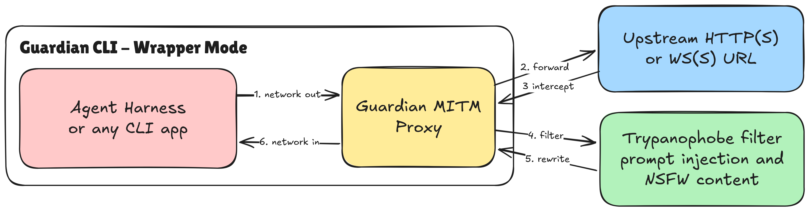
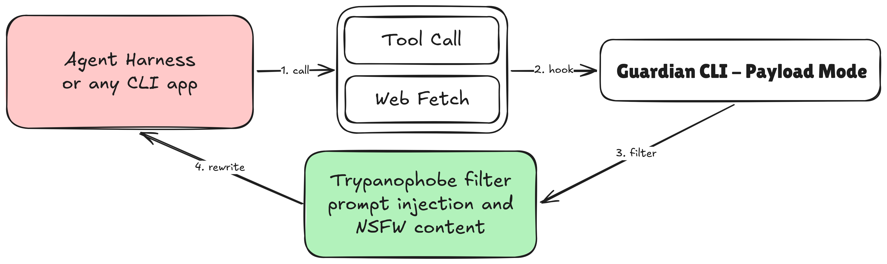

# Guardian

Put a safety filter between your AI agent and the outside world.

Guardian wraps the program your agent runs (Cursor, Claude Code, OpenCode, a custom script, etc.). When filtering is on, it intercepts **HTTP, HTTPS, WebSocket, and secure WebSocket (WS/WSS)** traffic from that program, sends each response to your filter for approval, and only passes through what the filter allows. It can also filter **tool-call payloads** before they reach the agent.

Without a filter URL, Guardian is a thin passthrough — useful for testing the wrapper, not for safety.

## Quick start

You need a **filter URL** (`--tpf`): a server that accepts `POST` requests and returns **HTTP 200** to allow content, or **any other status** to block it. ([Filter contract](#filter-contract) below.)

### 1. Download

Get the latest build from **[Releases → nightly](https://github.com/Sparse-Dynamix/guardian/releases/tag/nightly)**.

| OS | File | Binary |
|----|------|--------|
| Linux | `guardian-*-linux-x86_64.tar.gz` | `guardian` |
| macOS | `guardian-*-mac-x86_64.tar.gz` | `guardian` |
| Windows | `guardian-*-win-x86_64.zip` | `guardian.exe` |

Extract the archive. **Keep every file in that folder together** — if a Frida library (`libfrida-core.so`, `libfrida-core.dylib`, or `frida-core.dll`) is included, it must stay next to the binary.

### 2. Install

```bash
# Linux
mkdir -p ~/guardian && cd ~/guardian
gh release download nightly -R Sparse-Dynamix/guardian -p '*linux*'
tar -xzf guardian-*-linux-x86_64.tar.gz
chmod +x guardian-*-linux-x86_64/guardian
```

```bash
# macOS (sign once so macOS will run the binary)
mkdir -p ~/guardian && cd ~/guardian
gh release download nightly -R Sparse-Dynamix/guardian -p '*mac*'
tar -xzf guardian-*-mac-x86_64.tar.gz
codesign -s - -f --entitlements guardian-*-mac-x86_64/entitlements.plist guardian-*-mac-x86_64/guardian
```

```powershell
# Windows (PowerShell)
New-Item -ItemType Directory -Force -Path "$env:USERPROFILE\guardian" | Out-Null
Set-Location "$env:USERPROFILE\guardian"
gh release download nightly -R Sparse-Dynamix/guardian -p '*win*'
Expand-Archive -Path (Get-ChildItem guardian-*-win-x86_64.zip).Name -DestinationPath . -Force
```

No `gh` CLI? Download the matching archive from the [nightly release](https://github.com/Sparse-Dynamix/guardian/releases/tag/nightly) page and extract it manually.

Point your shell at the binary (adjust the folder name to match what you extracted):

```bash
# macOS / Linux
export GUARDIAN_BIN=~/guardian/guardian-*-*/guardian   # or guardian.exe on Windows
```

```powershell
# Windows
$env:GUARDIAN_BIN = "$env:USERPROFILE\guardian\guardian-*-win-x86_64\guardian.exe"
```

### 3. Run your agent through Guardian

```bash
$GUARDIAN_BIN --tpf https://your-filter.example/check -- your-agent-command --args
```

Examples:

```bash
$GUARDIAN_BIN --tpf https://your-filter.example/check -- opencode
$GUARDIAN_BIN --tpf https://your-filter.example/check -- cursor-agent ...
```

Set the filter once via environment variable if you prefer:

```bash
export GUARDIAN_TRYPANOPHOBE_FILTER=https://your-filter.example/check
$GUARDIAN_BIN --tpf "$GUARDIAN_TRYPANOPHOBE_FILTER" -- your-agent-command
```

**Harness note for integrators:** the wrapped program should not use stdin (`stdin: 'ignore'` / `Stdio::null()`). Payload mode uses stdin instead — see below.

### 4. HTTPS (encrypted traffic)

Guardian decrypts HTTPS so it can inspect responses, using a local certificate authority stored in `~/.guardian`. Pick the path that fits your setup:

**Most CLI agents (no admin)** — Guardian passes trust to the wrapped program via environment variables (`SSL_CERT_FILE`, `NODE_EXTRA_CA_CERTS`, etc.). Add `--skip-cert-regen` so the same CA is reused every run:

```bash
$GUARDIAN_BIN --skip-cert-regen --tpf https://your-filter.example/check -- your-agent-command
```

**Browsers, Java, or anything that only trusts the system certificate store** — install the CA once with admin rights:

```bash
sudo $GUARDIAN_BIN install-system
$GUARDIAN_BIN check-system          # should report the CA is trusted
```

```powershell
# Windows (Administrator PowerShell)
& $env:GUARDIAN_BIN install-system
& $env:GUARDIAN_BIN check-system
```

Remove when done: `guardian remove-system` or `sudo guardian clean`.

### 5. Verify

```bash
$GUARDIAN_BIN --version
$GUARDIAN_BIN --skip-cert-regen --tpf https://your-filter.example/check -- curl -s https://httpbin.org/get
```

If the filter returns non-200, the response is blocked and the agent never sees it.

## Payload mode (tool calls)

Filter a tool-call payload directly instead of wrapping a child process:

```bash
$GUARDIAN_BIN --tpf https://your-filter.example/check --payload '{"tool":"read_file","path":"..."}'
echo '{"tool":"read_file"}' | $GUARDIAN_BIN --tpf https://your-filter.example/check
```

Do not pass a child program after `--` in payload mode.

## Agent setup checklist

If you are an AI agent installing Guardian for a user, follow these steps in order:

1. **Detect OS** (Linux, macOS, or Windows).
2. **Download** the matching archive from [nightly](https://github.com/Sparse-Dynamix/guardian/releases/tag/nightly).
3. **Extract** to a stable path (e.g. `~/guardian` or `%USERPROFILE%\guardian`).
4. **macOS only:** run `codesign` with the bundled `entitlements.plist` (see step 2 above).
5. **Set `GUARDIAN_BIN`** to the full path of `guardian` / `guardian.exe`. Keep all files from the archive in the same directory.
6. **Ask the user for their filter URL** (`--tpf`) or read `GUARDIAN_TRYPANOPHOBE_FILTER` if already set.
7. **Wrap the user's agent command:** `guardian --skip-cert-regen --tpf <URL> -- <their-agent-cmd>`.
8. **If HTTPS fails** with certificate errors, run `install-system` + `check-system` (requires user approval for admin).
9. **Confirm** with `guardian --version` and a test request through the filter.

Common flags: `--tps` replaces allowed content with the filter's response body; `--ca-dir` changes where the CA is stored; `guardian --help` for the full list.

## Filter contract

Your filter receives a `POST` with the **raw response bytes** as the body.

- For HTTP responses, Guardian appends `?url=<request-url>` to the filter URL.
- **200** → allow (forward to the agent).
- **Any other status** → block (agent sees a safety message instead).
- With `--tps`, a `200` response body and headers **replace** what the agent would have seen.

WebSocket server→client text and binary frames are checked the same way.

## Modes at a glance



Wrap a child process — intercepts HTTP(S) and WS(S) from that process when `--tpf` is set.



Filter tool-call JSON via `--payload` or piped stdin.

## Build from source

See [AGENTS.md](AGENTS.md#build).

## License

GPL-3.0 — [LICENSE](LICENSE). Third-party notices: [NOTICE.txt](NOTICE.txt).
